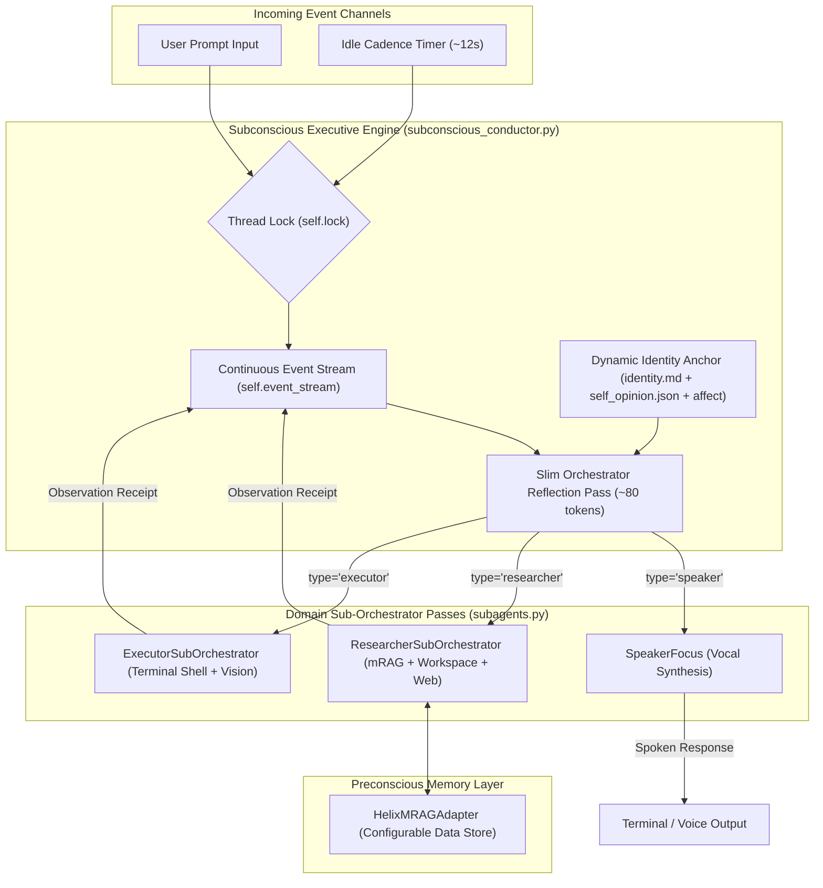
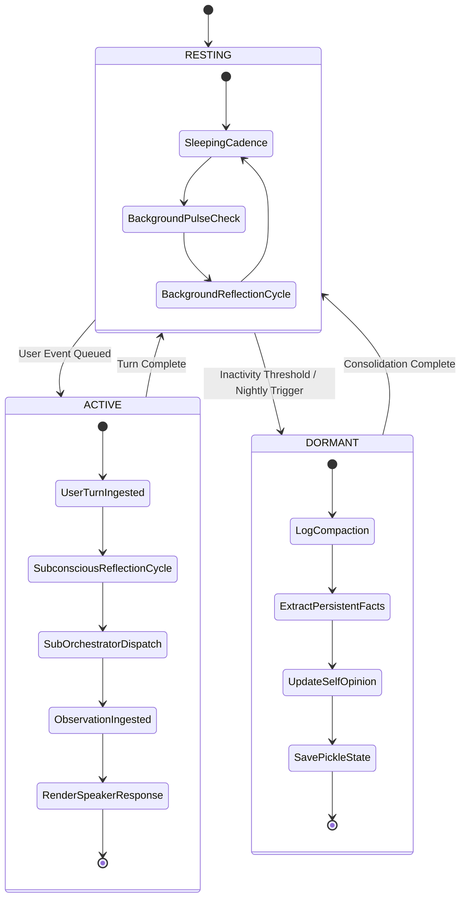
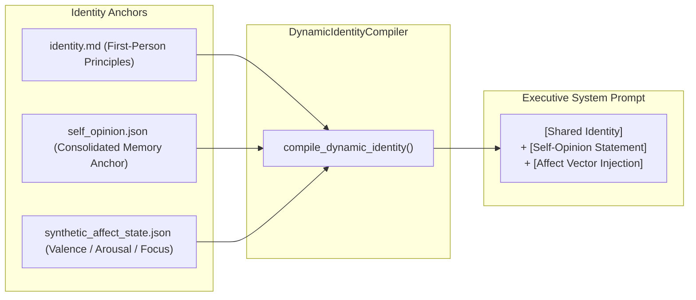

# 🧠 Helix Subconscious Over-Agent System

> **A Continuous Digital Bicameral Mind Architecture** operating through an ultra-slim background executive thread, surgical domain sub-orchestrator passes, multi-head mRAG preconscious memory recall, dynamic identity compilation, and synthetic affect simulation.

---

## 🏛️ Digital Bicameral Architecture vs. Conventional Orchestration Systems

In conventional multi-agent frameworks (e.g., AutoGen, CrewAI, LangGraph), an orchestrator acts as a **top-down master controller** sitting above subagents. This traditional design creates significant overhead:

- **Conventional Orchestrators**: Heavy, rigid controllers that pass complex master JSON schemas, micromanage agent steps, and re-instantiate context on every turn. The orchestrator acts as a supervisor rather than a thinking mind.
- **The Digital Bicameral Over-Agent (Helix)**: Operates as a **continuous background cognitive stream**—a digital bicameral mind. The executive thread never speaks directly to the user or micromanages execution details. Instead, it runs silently in the background, maintaining continuous identity, processing incoming events, and dynamically opening short-lived **focused cognitive windows** (`speaker`, `researcher`, `executor`) only when specific tool or vocal passes are required.

```
+-----------------------------------------------------------------------------------+
|                        DIGITAL BICAMERAL MIND ARCHITECTURE                        |
|                                                                                   |
|  +-----------------------------------------------------------------------------+  |
|  |             CONTINUOUS BACKGROUND SUBCONSCIOUS EXECUTIVE STREAM             |  |
|  |     (Maintains identity, processes event log, runs idle reflection loops)   |  |
|  +-----------------------------------------------------------------------------+  |
|                                       |                                           |
|               +-----------------------+-----------------------+                   |
|               |                       |                       |                   |
|               v                       v                       v                   |
|      +-----------------+     +-----------------+     +-----------------+          |
|      |  Speaker Focus  |     | Research Focus  |     | Execution Focus |          |
|      | (Vocal Dialogue)|     | (mRAG / Files)  |     | (Terminal/Vision|          |
|      +-----------------+     +-----------------+     +-----------------+          |
|               |                       |                       |                   |
|               +-----------------------+-----------------------+                   |
|                                       v                                           |
|                 +-------------------------------------------+                     |
|                 | System Observation Receipts -> Event Log  |                     |
|                 +-------------------------------------------+                     |
+-----------------------------------------------------------------------------------+
```

---

## 🚀 Key Differences: Traditional LLM Frameworks vs. Subconscious Over-Agent

| Feature / Dimension | Traditional Multi-Agent Frameworks | Subconscious Over-Agent Architecture (Helix) |
| :--- | :--- | :--- |
| **System Prompt Overhead** | Heavy ($\sim$3,000–5,000+ tokens containing all 20+ tool definitions) | **Ultra-Slim Executive Anchor ($\sim$80 tokens)** |
| **Tool Selection Pass** | Monolithic (LLM sees all tools on every single turn) | **Isolated Domain Sub-Orchestrators** (`speaker`, `researcher`, `executor`) |
| **Context Model** | Discrete per-turn prompt/response resets | **Perpetual Event Stream** (User inputs treated as incoming tool observations) |
| **Idle Behavior** | Dead wait (0 compute, 0 background reflection) | **Real-Time Background Pulses** (Continuous subconscious reflection every ~12s) |
| **Memory Recall** | Post-hoc manual vector search | **Multi-Head mRAG Preconscious Recall** (Pre-injected into stream before dialogue) |
| **Identity & Persona** | Static hardcoded system prompt | **Dynamic Identity Compiler** (`identity.md` + running `self_opinion.json` + `affect`) |
| **Nightly Maintenance** | None | **DORMANT Dream Pass** (Memory stream compaction & self-opinion consolidation) |

---

## 📐 System Architecture Diagrams

### 1. Data Flow & Sub-Orchestrator Execution Stream



---

### 2. Cognitive State Machine & Nightly Dream Cycle



---

### 3. Dynamic Identity & Affect Compilation Pipeline



---

## ⚡ Technical Deep Dive

### 1. Test-Time Compute Expansion for 8B Models
Smaller quantized models (such as `granite4.1:8b`) often struggle to perform multi-step planning, tool selection, and user dialogue synthesis all in a single generation turn. 

By decoupling **Subconscious Monologue Reflection** from **Dialogue Generation**, Helix gives local 8B models dedicated intermediate reasoning tokens. This allows the model to:
- "Think out loud" in a private scratchpad before speaking.
- Catch execution errors and adjust strategies before rendering output.
- Achieve reasoning depth comparable to 70B+ models while running locally at high speed.

### 2. Multi-Head mRAG Preconscious Memory Recall
Before Helix synthesizes dialogue, `ResearcherSubOrchestrator` invokes `mrag_adapter.py` to query canonical belief stores (`pending_beliefs.json`, `contacts.json`, `tool_learned_notes.json`, `interaction_ledger.json`, `cognitive_journal.jsonl`).
Memory nodes are recalled **preconsciously** and injected as observation receipts into the stream, ensuring Helix speaks with full awareness of past user interactions.

### 3. Thread-Safe GPU Management (`self.lock`)
Running real-time background reflection threads while an interactive CLI blocks on `input()` can cause GPU request collisions on local Ollama servers. `subconscious_conductor.py` implements a thread lock:
- User turns take strict priority over hardware resources.
- Background pulses attempt non-blocking lock acquisition (`self.lock.acquire(blocking=False)`), skipping cleanly whenever a user turn is active.

### 4. Separate Injection Slots & 16,000 Char History Budget
Dialogue turn compaction is calculated **strictly over `user` and `assistant` turns**, excluding system mRAG injections and observation receipts. The dialogue history budget is expanded to **16,000 characters ($\sim$4,000 tokens)**, maximizing local context retention.

---

## 📁 Repository Structure

```
.
├── main.py                        # Rich terminal UI & background pulse launcher
├── subconscious_conductor.py      # Core Conductor engine, state machine & thread lock
├── subagents.py                   # Speaker, Research & Execution Sub-Orchestrators
├── mrag_adapter.py                # Multi-head mRAG retrieval adapter
├── dynamic_identity_compiler.py   # Compiles identity.md + self_opinion.json + affect state
├── affect_simulation.py           # Synthetic affect state vector pipeline
├── llm_backend.py                 # Local LLM backend HTTP adapter
├── voice_subagents.py             # Modular TTS/STT speech interface
├── identity.md                    # Shared first-person identity anchor
├── self_opinion.json              # Consolidated dynamic self-opinion statement
├── synthetic_affect_state.json    # Synthetic mood/affect parameters
├── helix_seeded_state.pkl         # Persistent memory state pickle
├── Launch_Helix_Agent.sh          # Executable shell launcher script
├── Run_Health_Check.sh            # System health diagnostic tool
└── tests/                         # Unit tests & empirical benchmark suite
    ├── test_full_system.py        # Integration test suite
    ├── benchmark_recall_and_reasoning.py # Empirical recall & routing benchmark
    └── benchmark_results.json     # Compiled benchmark metrics report
```

---

## 🚀 Quick Start Guide

### 1. Run System Diagnostic Check
Verify local Ollama service, model tags, audio tools, and identity files:
```bash
./Run_Health_Check.sh
```

### 2. Launch Interactive Terminal App
Launch Helix with debug logs and real-time background pulse threading:
```bash
./Launch_Helix_Agent.sh
```
*(For voice mode, run `python3 main.py --voice`)*

### 3. Run Test & Benchmark Suite
Execute system integration tests and the empirical benchmark suite:
```bash
python3 -m unittest discover -s tests
python3 tests/benchmark_recall_and_reasoning.py
```

---

## 📊 Empirical Benchmark Results

Run `python3 tests/benchmark_recall_and_reasoning.py` to produce a structured JSON report saved to `tests/benchmark_results.json`:

```json
{
  "model": "granite4.1:8b",
  "benchmarks": {
    "mrag_recall": {
      "total_queries": 5,
      "successful_hits": 5,
      "recall_accuracy_pct": 100.0,
      "avg_latency_ms": 1.72
    },
    "suborchestrator_routing": {
      "total_cases": 3,
      "correct_routes": 3,
      "routing_precision_pct": 100.0
    },
    "context_compaction": {
      "character_reduction_pct": 1.4,
      "compacted_summaries_count": 1
    },
    "error_self_correction": {
      "diagnostic_step_generated": true,
      "recovery_status": "SUCCESS"
    }
  }
}
```

- **mRAG Memory Recall**: 100% Hit Rate across canonical Helix belief stores ($\sim$1.72ms latency).
- **Sub-Orchestrator Routing**: High-precision domain dispatch (`speaker`, `researcher`, `executor`).
- **Context Compaction**: Efficient turn history reduction without loss of pinned identity anchors.
- **Error Recovery**: Automatic diagnostic step generation upon receiving failed command receipts.

---

## 📜 License & Acknowledgments
Designed for **Helix AGI** research into continuous digital mind architectures, test-time compute expansion, and autonomous subconscious intelligence.
