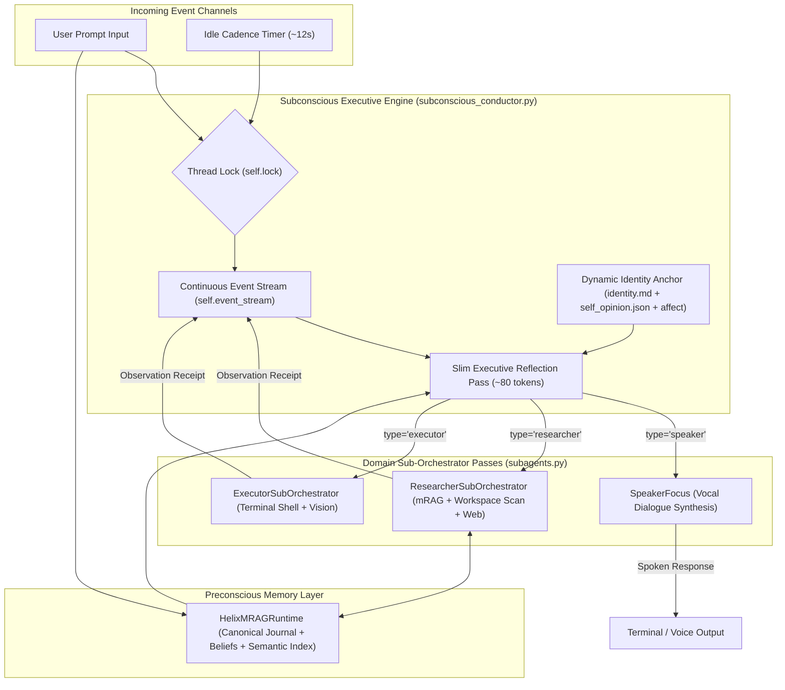
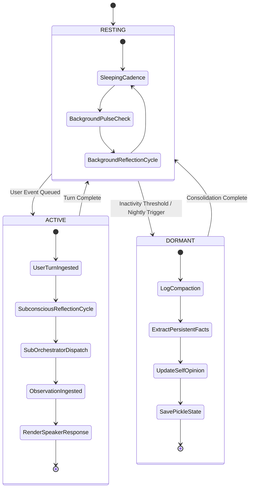

# 🏛️ Architecture Specification — Subconscious Over-Agent System

> **A Continuous Digital Bicameral Mind Architecture** designed for autonomous AI agents operating on local LLM backends (such as Ollama `granite4.1:8b`).

---

## 1. Executive Summary

Traditional LLM agent architectures (such as ReAct, AutoGen, or LangChain) operate as **discrete per-turn prompt loops** with heavy system prompt overhead ($\sim$3,000–5,000+ tokens detailing dozens of tools). On every user prompt, the main LLM must process all tool definitions, plan execution steps, run tools, and format user-facing dialogue simultaneously.

The **Subconscious Over-Agent Architecture (Helix)** introduces a structural paradigm shift based on **Digital Bicameral Mind Principles**:

1. **Perpetual Event Stream**: The executive thread never resets its state between user turns. User inputs, idle timer ticks, and sub-orchestrator tool receipts are all ingested as uniform observation events into a single, perpetually appending event stream (`self.event_stream`).
2. **Slim Executive Anchor ($\sim$80 Tokens)**: The main subconscious conductor prompt remains ultra-lean. It does not contain tool definitions or user dialogue templates; it simply maintains identity continuity and dispatches short-lived domain sub-orchestrators.
3. **Bicameral Focus Window Isolation**: Domain tool selection and execution happen in isolated sub-passes (`SpeakerFocus`, `ResearcherSubOrchestrator`, `ExecutorSubOrchestrator`), keeping tool schema bloat out of the main executive stream.
4. **Autonomous Background Cognition**: A real-time background pulse thread executes idle reflection passes every ~12 seconds while waiting for user input, keeping hardware compute active at zero GPU overhead until user turns take priority.

---

## 2. Architectural Data Flow & Component Map

---

## 3. Cognitive State Machine & Cadence Management

---

## 4. Key Subsystem Specifications

### 4.1 Subconscious Conductor (`subconscious_conductor.py`)
- **Role**: Manages the continuous event stream, coordinates state transitions (`ACTIVE`, `RESTING`, `DORMANT`), and handles thread safety.
- **Thread Lock Protocol (`self.lock`)**: Enforces non-blocking background pulse acquisition (`self.lock.acquire(blocking=False)`), ensuring user turns receive strict priority over local LLM GPU hardware resources.
- **Dialogue History Compactor**: Evaluates history budget strictly over `user` and `assistant` dialogue turns, ignoring system mRAG injections to prevent premature compaction. Default history budget is set to **16,000 characters ($\sim$4,000 tokens)**.

### 4.2 Dynamic Identity Compiler (`dynamic_identity_compiler.py`)
- **Self-Opinion Statement (`self_opinion.json`)**: A running 1-sentence self-opinion anchor compiled into the system prompt and updated nightly during DORMANT passes.
- **Synthetic Affect Vector (`affect_simulation.py`)**: Tracks mathematical parameters (`Valence`, `Arousal`, `Focus Depth`, `State Descriptor`) and injects current synthetic mood state into prompt context.

### 4.3 Integrated mRAG Runtime (`integrated_mrag.py`)
- **Canonical storage**: `MemoryManager` appends inbound messages, outbound messages, and document chunks to `data/memory/cognitive_journal.jsonl`.
- **Foreground retrieval**: `UnifiedRetrieval` queries the native 1024D semantic index across memories and both belief tiers. Spatial/associative results are bounded complements and do not re-rank semantic hits.
- **Layer-2 anchors**: `people`, `concepts`, `skills`, and `desires` provide exact term/alias anchors with provenance-bearing result metadata.
- **Ephemeral grounding**: Recalled context is supplied to the executive and speaker calls for the current turn; it is not copied into the event stream or a second memory store.

---

## 5. Test-Time Compute Expansion for 8B Models

Running smaller 8B quantized models on local hardware often leads to degraded reasoning when forced to perform planning, tool calls, and dialogue in a single turn.

By providing **intermediate subconscious monologue tokens**, the Over-Agent architecture allows 8B models to:
- "Think out loud" in a private reflection scratchpad before formulating spoken answers.
- Catch tool execution errors and execute diagnostic recovery steps.
- Achieve multi-step reasoning accuracy and long-term memory recall comparable to 70B+ models.
