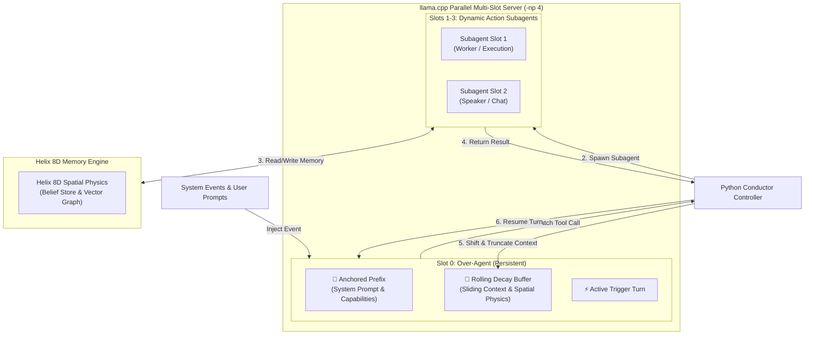

# Subconscious Over-Agent Architecture Design Plan

## 1. Executive Overview

The **Subconscious Over-Agent** is a persistent, silent executive conductor that runs in a continuous event loop on a dedicated `llama.cpp` KV-cache slot. It never speaks directly to the user; instead, it receives system events, user signals, and memory activations, dynamically orchestrating lightweight **Action Subagents** that inherit a shared Helix 8D Spatial Memory state.

To allow the Over-Agent to run **indefinitely without context overflow**, the architecture implements **Anchored Sliding Context Decay**:
1. **Anchor Block (Pinned)**: System Identity + Subagent Capability Registry (Never fades).
2. **Decay Window (Rolling)**: Sliding event stream where old turns dynamically fade based on age and spatial importance.
3. **Active Working Context (Present)**: Real-time environmental triggers and subagent dispatch results.

---

## 2. System Architecture & Schematics



---

## 3. Context Memory Layout (Anchored Sliding Window)

```text
┌─────────────────────────────────────────────────────────────────────────┐
│ 📌 PINNED ANCHOR ZONE (Immutable / Never Truncated)                      │
│ • System Role: Subconscious Executive Over-Agent                        │
│ • Subagent Capabilities Registry (JSON Schema)                          │
│ • Core Helix Belief Graph Rules & Operating Directives                  │
├─────────────────────────────────────────────────────────────────────────┤
│ 🌊 ROLLING DECAY ZONE (Dynamic Truncation & Spatial Pruning)            │
│ • Older Event Turns (Compressed to 1-line summaries or spatially pruned)│
│ • Expired Subagent Dispatch History                                    │
├─────────────────────────────────────────────────────────────────────────┤
│ ⚡ ACTIVE PRESENT ZONE (Real-Time Inputs)                                │
│ • Latest User Intent / Environmental Trigger                            │
│ • Pending Subagent Result (<tool_response>)                             │
└─────────────────────────────────────────────────────────────────────────┘
```

---

## 4. Core Code Concepts (Python + `llama.cpp` REST API)

### 4.1. Conductor Controller (`subconscious_conductor.py`)

```python
import json
import time
import requests
from typing import Dict, List, Any

LLAMA_SERVER_URL = "http://localhost:8080"
SLOT_OVERAGENT = 0
SLOT_SUBAGENTS = [1, 2, 3]

PINNED_SYSTEM_PROMPT = """You are the Subconscious Over-Agent.
You do NOT speak to the user directly. You orchestrate system actions by dispatching subagents.

AVAILABLE SUBAGENT CAPABILITIES:
1. "speaker_subagent": Speaks to the user, presents final answers and UI formatting.
2. "coder_subagent": Modifies source files, executes build/test scripts.
3. "research_subagent": Searches vector stores, reads files, inspects databases.

DIRECTIVES:
- Maintain long-term goal alignment using Helix 8D Spatial Memory.
- Never output natural language prose directly to the user. Always use `dispatch_subagent`.
"""

class SubconsciousConductor:
    def __init__(self, max_context_tokens: int = 8192, anchor_tokens: int = 1024):
        self.max_tokens = max_context_tokens
        self.anchor_tokens = anchor_tokens
        self.rolling_history: List[Dict[str, str]] = []
        self.helix_memory = self._init_helix_memory()

    def _init_helix_memory(self):
        # Connect to Helix 8D Physics Engine
        from Helix.memory.belief_store import BeliefStore
        return BeliefStore()

    def build_prompt(self, new_event: str) -> str:
        """Construct prompt with Pinned Anchor + Decayed History + Present Event."""
        prompt_parts = [
            f"<system>\n{PINNED_SYSTEM_PROMPT}\n</system>\n"
        ]
        
        # Add rolling decay history (pruned if exceeding budget)
        for msg in self._get_decayed_history():
            prompt_parts.append(f"<{msg['role']}>\n{msg['content']}\n</{msg['role']}>\n")
            
        # Add new active event
        prompt_parts.append(f"<user_event>\n{new_event}\n</user_event>\n<assistant>\n")
        return "".join(prompt_parts)

    def _get_decayed_history(self) -> List[Dict[str, str]]:
        """Applies spatial physics decay & token limits to keep old context fresh."""
        # Keep only recent turns that fit within token limit (leaving room for anchor)
        budget = self.max_tokens - self.anchor_tokens - 1500
        pruned_history = []
        current_cost = 0
        
        for msg in reversed(self.rolling_history):
            cost = len(msg['content'].split()) * 1.3  # Approx token count
            if current_cost + cost > budget:
                break
            pruned_history.insert(0, msg)
            current_cost += cost
            
        return pruned_history

    def step(self, event_text: str):
        """Execute one cycle of the subconscious loop."""
        full_prompt = self.build_prompt(event_text)
        
        # Dispatch to llama.cpp Slot 0
        response = requests.post(f"{LLAMA_SERVER_URL}/completion", json={
            "prompt": full_prompt,
            "stream": False,
            "id_slot": SLOT_OVERAGENT,
            "temperature": 0.2,
            "stop": ["</assistant>", "</tool_call>"]
        }).json()

        text_output = response.get("content", "").strip()
        
        if "dispatch_subagent" in text_output:
            self._handle_subagent_dispatch(text_output)
        else:
            # Record observation in rolling history
            self.rolling_history.append({"role": "assistant", "content": text_output})

    def _handle_subagent_dispatch(self, tool_call_str: str):
        """Runs subagent on Slot 1-3 using shared model weights."""
        print(f"[Subconscious] Dispatching action subagent: {tool_call_str}")
        # Parse dispatch details
        dispatch_data = json.loads(tool_call_str.split("dispatch_subagent(")[1].rstrip(")"))
        subagent_type = dispatch_data.get("type")
        prompt = dispatch_data.get("prompt")

        # Execute subagent on free slot
        sub_resp = requests.post(f"{LLAMA_SERVER_URL}/completion", json={
            "prompt": f"<system>You are the {subagent_type}.</system>\n<user>{prompt}</user>\n",
            "id_slot": 1,  # Subagent slot
            "temperature": 0.7
        }).json()

        sub_result = sub_resp.get("content", "")
        
        # Append result to Over-Agent history so it knows task completed
        self.rolling_history.append({
            "role": "system",
            "content": f"Subagent [{subagent_type}] finished. Result: {sub_result[:300]}..."
        })
```

---

## 5. Key Highlights & Advantages

1. **`llama.cpp` `--parallel 4` Execution**:
   - Model weights (e.g. `granite4.1:8b`) are loaded into VRAM **once**.
   - Slot 0 maintains the persistent Over-Agent KV-cache.
   - Slots 1-3 handle subagents concurrently.

2. **Immutable Anchor Pinning**:
   - The System Role and Subagent Capability Definitions are prepended to every generation turn, ensuring the Over-Agent **never forgets its identity or tools**.

3. **Spatial Physics Context Truncation**:
   - As event history grows, old events are dynamically truncated or summarized into 1-line Spatial Beliefs stored in Helix's 8D Physics Engine.
