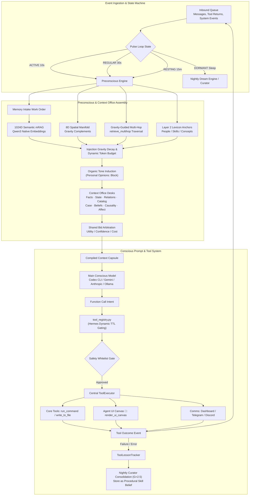

# Helix Current Technical Architecture

**Status:** Canonical Live Architecture · **Last Verified Against Source:** 2026-08-14 · **Branch:** `main`

This document is the authoritative technical reference for Helix's live runtime architecture. It details module contracts, retrieval pipelines, dynamic tool execution, memory storage, and state persistence.

---

## Runtime Architecture Overview

---

## 1. Boot, Wiring & Module Contracts

The system entry point [`main.py`](file:///home/nemo/_mrag_composite_test/main.py#L30-L120) instantiates and wires all primary cognitive singletons:

1. **[`BeliefStore`](file:///home/nemo/_mrag_composite_test/memory/belief_store.py#L40-L110)**: Normalized SQLite & JSON store across 7 categories.
2. **[`MemoryManager`](file:///home/nemo/_mrag_composite_test/memory/memory_manager.py#L30-L90)**: Manages [`cognitive_journal.jsonl`](file:///home/nemo/_mrag_composite_test/memory/cognitive_journal.py) append-only storage and 1024D native [`SemanticIndex`](file:///home/nemo/_mrag_composite_test/memory/semantic_index.py#L40-L120).
3. **[`PhysicsEngine`](file:///home/nemo/_mrag_composite_test/core/physics_engine.py#L40-L130)** & **[`SpatialMind`](file:///home/nemo/_mrag_composite_test/core/spatial_mind.py#L40-L110)**: Governs 384D $\to$ 8D Johnson-Lindenstrauss projection, Verlinde entropic gravity, and KD-Tree spatial queries.
4. **[`Preconscious`](file:///home/nemo/_mrag_composite_test/core/preconscious.py#L100-L200)** & **[`UnifiedRetrieval`](file:///home/nemo/_mrag_composite_test/core/unified_retrieval.py#L40-L150)**: Coordinates 1024D mRAG, 8D spatial complements, multi-hop traversal, and `Personal Opinions:` tone blocks.
5. **[`ContextOffice`](file:///home/nemo/_mrag_composite_test/core/preconscious.py#L1880-L1950)**: Performs shared bid arbitration across specialist desks.
6. **[`ToolExecutor`](file:///home/nemo/_mrag_composite_test/tools/tool_executor.py#L30-L110)** & **[`registry`](file:///home/nemo/_mrag_composite_test/tools/tool_registry.py#L30-L110)**: Dynamic Hermes-style tool discovery, TTL availability caching, and execution.
7. **[`PulseLoop`](file:///home/nemo/_mrag_composite_test/core/pulse_loop.py#L120-L280)**: Event-driven consciousness loop controlling state transitions and execution cadences.

---

## 2. Multi-Head 1024D mRAG & 8D Spatial Retrieval

Context retrieval during each pulse turn is executed by `UnifiedRetrieval` ([`core/unified_retrieval.py`](file:///home/nemo/_mrag_composite_test/core/unified_retrieval.py#L200-L380)):

- **Multi-Head Semantic Foreground (1024D)**: Embeds trigger text with `qwen3-embedding:0.6b` (1024D) and queries the FAISS FlatIP index across historical sessions, beliefs, and documents.
- **Bounded 8D Spatial Complements**: Queries raw 8D spatial gravity fields (`query_neighborhood()`) to pull lateral, non-displacing associative context (max 1–2 items).
- **Gravity-Guided Multi-Hop Traversal (`retrieve_multihop`)**: For multi-question or relational triggers, `retrieve_multihop()` locates Hop 1 evidence, extracts 8D gravity-basin keywords, and performs a directed Hop 2 retrieval ([`core/unified_retrieval.py`](file:///home/nemo/_mrag_composite_test/core/unified_retrieval.py#L300-L365)).
- **Organic Tone Induction (`Personal Opinions:`)**: Extracts affectively salient 1st-person orientation statements and formats them into a `Personal Opinions:` block for the conscious model ([`core/unified_retrieval.py`](file:///home/nemo/_mrag_composite_test/core/unified_retrieval.py#L366-L410)).

---

## 3. Dynamic Hermes Tool Registry & Agent UI Canvas

### Dynamic Tool Registration
All system tools are dynamically registered in [`tools/tool_registry.py`](file:///home/nemo/_mrag_composite_test/tools/tool_registry.py#L30-L110) with runtime `check_fn` functions and 30-second TTL caching. Only available, authorized tools are exposed to the active session.

### Agent UI Canvas (`render_ui_canvas`)
The `ui_canvas` toolset ([`tools/ui_canvas_tool.py`](file:///home/nemo/_mrag_composite_test/tools/ui_canvas_tool.py#L25-L95)) allows Helix to dynamically alter and render custom views on the user's Web Dashboard UI at `localhost:5050` ([`dashboard/dashboard.py`](file:///home/nemo/_mrag_composite_test/dashboard/dashboard.py#L420-L535) & [`dashboard/dashboard_ui.html`](file:///home/nemo/_mrag_composite_test/dashboard/dashboard_ui.html#L476-L510)):
- `markdown`: Rich formatted reports and documents.
- `image`: Generated diagrams, charts, and media assets.
- `browser`: Embedded external web pages and live URLs.
- `terminal`: Execution logs and sandbox terminal streams.
- `card`: Big emphasis status cards and hero banners.

### Tool Failure Learning Loop
Tool execution failures are trapped by `ToolLessonTracker` ([`core/tool_lesson_tracker.py`](file:///home/nemo/_mrag_composite_test/core/tool_lesson_tracker.py#L20-L90)). Lessons are deduplicated and queued for nightly Curator consolidation ($G=2.5$), crystallizing into `skills` beliefs with tool bindings.

---

## 4. 1-Click Launchers & Verification Suites

- **Launch Agent**: `./Launch\ Helix\ Agent.sh`
- **Setup Wizard**: `./Helix\ Setup\ Wizard.sh`
- **System Health Diagnostic**: `./Run\ Health\ Check.sh` ([`scripts/run_health_check.py`](file:///home/nemo/_mrag_composite_test/scripts/run_health_check.py))
- **Interactive Benchmark Suite Runner**: `./Run\ Benchmarks.sh` ([`tests/run_all_benchmarks.py`](file:///home/nemo/_mrag_composite_test/tests/run_all_benchmarks.py))
