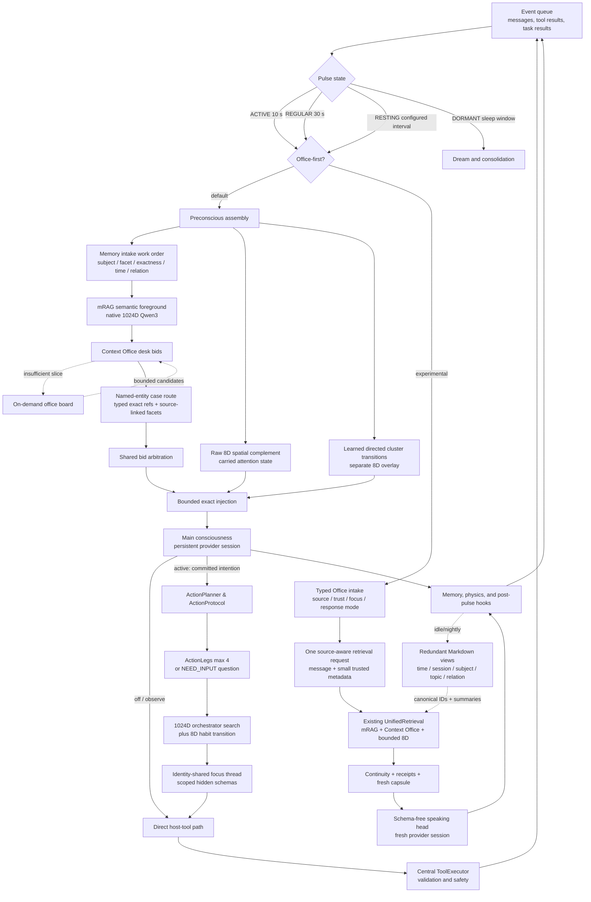

# Helix Current Technical Architecture

**Status:** canonical current architecture · **Last verified against source:** 2026-08-15 · **Applies to:** `feature/typed-memory-retrieval`

This document is the shortest authoritative description of the live Helix runtime. Historical audits and benchmark reports are intentionally not updated to imitate this design; see the [documentation index](README.md) for their status.

## Runtime at a Glance

## Boot and Ownership

`main.py` wires one shared `MemoryManager`, `BeliefStore`, `PhysicsEngine`, `Preconscious`, `ToolExecutor`, provider configuration, and pulse loop. The standard `PulseLoop` owns the conscious provider session, event queue, serial 8D attention trajectory, memory encoding, and post-pulse hooks.

`TaskCognitionController` is attached after the standard runtime exists. Focus threads share Helix's identity, beliefs, memory corpus, semantic encoder, and host executor, but they do not move the conscious 8D attention center or teach memory associations. This avoids races and prevents parallel work from being mistaken for autobiographical attention.

`HELIX_OFFICE_FIRST=1` enables the experimental alternate path in the standard `PulseLoop`. It retains a typed mirror of each event instead of discarding source provenance during natural-language translation. A deterministic Office coordinator then uses the existing mRAG, Context Office, entity cases, belief and affect views, recent exact turns, action receipts, and one explicitly non-evidentiary 8D association to build a fresh capsule. The speaking head is a new schema-free provider session on every pulse, so no cached chat history or large identity system prompt is required. The default remains the established persistent-session preconscious path.

Each event makes one call to `UnifiedRetrieval`. The user's wording is augmented with only relevant source metadata such as sender/thread, author/audience, file path/objective, search query, or tool/task name. The existing mRAG and Context Office modules continue to own all search heads and arbitration; the runtime adapter does not reproduce either mechanism.

## Action Path & Multi-Step Task Execution

To keep Helix's main consciousness small and provider-neutral, multi-step execution uses a dedicated **Action Path**:

1. **Intention Inception:** Concrete user requests generate a durable `TaskRecord` managed by `TaskCognitionController`.
2. **Action Leg Planning (`ActionPlanner`):** Generates at most **4 outcome-oriented legs** (`ActionLeg`) or asks **one material clarification question** (`NEED_INPUT:`).
3. **Context Budgets:**
   - Planner task text ≤ 300 tokens
   - Scoped context ≤ 400 tokens
   - Observation size ≤ 600 tokens per step
4. **Execution Protocol & Verification (`ActionProtocol`):**
   - File mutations require a matching read-back step.
   - Browser and GUI operations require subsequent DOM observation or screenshot.
   - Terminal and git actions require explicit observer confirmations.
5. **Procedural Learning:** Verified execution paths are recorded into `ProceduralMemory`; unverified or failed legs generate cautionary lessons for future routing.

## Pulse State Machine

| State | Default cadence | Transition behavior |
|---|---:|---|
| `ACTIVE` | 10 seconds | Entered by an incoming user or critical event |
| `REGULAR` | 30 seconds | Entered after 2 minutes without incoming activity |
| `RESTING` | 15 minutes, config-overridable | Entered after 10 minutes in `REGULAR`; wakes immediately for events |
| `DORMANT` | 60-second wake check | Entered during the configured sleep window; runs nightly dream work |

## Preconscious Retrieval Contract & Typed Record Envelopes

Retrieval is separated into semantic advice, a deterministic Context Office evidence brief, and bounded non-semantic complements.

All canonical journal memories are decorated at runtime with a `RecordEnvelope` (`memory/record_envelope.py`) that classifies record kinds (`thought`, `inbound_message`, `outbound_message`, `tool_call`, `tool_result`, `task_outcome`), supporting assertions, and verification status without rewriting stored `.jsonl` files.

| Order | Lane | Representation | Contract |
|---:|---|---|---|
| 1 | Memory intake | Deterministic query work order | Removes transport framing and identifies named subjects, requested facets, exactness, chronology, and relational scope |
| 2 | Layer-2 anchors | Named people, concepts, skills, desires | Exact high-priority anchors with repetition guard |
| 3 | mRAG semantic advisor | Native normalized 1024D Qwen3 embeddings | Full-trigger, sentence, RAKE, entity, concept, and relation heads plus exact-term/tag evidence |
| 4 | Maintained text views | Redundant Markdown logs by time, session, subject, topic, and relation | Copies retain one canonical memory ID; deduplicated by ID |
| 5 | Context Office | Specialist desks over canonical memory | Facts, State, Relations, Catalog, Case, Beliefs, Causality, Affect, and Identity desks submit bids |
| 6 | Raw spatial / Lateral desk | MiniLM 384D projected to 8D | At most two spatial-only items; non-evidentiary |
| 7 | Associative transition | Directed cluster prototypes in separate 8D overlay | Surfaces lateral follow-ons based on repeated attention transitions |
| 8 | Working state | Stability, Lagrangian snapshot, scratchpad | Preserved for somatic echo and rendering |

## Provider Ecosystem

| Provider | Intended use | Tool behavior |
|---|---|---|
| `codex_cli` / `codex` | Continuous Helix consciousness via ChatGPT-authenticated Codex App Server | Host-mediated constrained actions; thought-only main session |
| `claude_cli` | Continuous API/subscription consciousness | Native CLI tool pass execution |
| Gemini | Continuous API-backed consciousness | Provider-native function calling through `ToolExecutor` |
| Anthropic | Continuous API-backed consciousness | Provider-native tool use through `ToolExecutor` |
| Ollama | Local consciousness | Local text/tool-dispatch compatibility path |
| llama.cpp | Local GGUF consciousness | Local GGUF compatibility path |

## Persistence Map

| Data | Location | Update model |
|---|---|---|
| Episodic/thought journal | `data/memory/cognitive_journal.jsonl` | Append-only events with sidecar compaction |
| Record Envelopes | Dynamically computed overlay | Standardized evidence assertions and typed metadata |
| Belief categories | `data/beliefs/*.json` | Category stores with confidence, mass, stability, and provenance |
| Semantic vectors | `data/spatial/semantic_index*` | Rebuildable 1024D index |
| Spatial state | `data/spatial/` | Two 8D fields, attention/physics state, associative transitions |
| Scratchpad | `data/scratchpad/` | Explicit working notes |
| Task cognition | `data/tasks/` | Atomic task records, action plans, procedures, and orchestrators |
| Entity cases | `data/cases/office_board.json` | Source references and session membership |
| Interaction ledger | `data/interaction_ledger.json` | Action provenance records |

For implementation and operator details, see [SYSTEM_MANUAL.md](../SYSTEM_MANUAL.md) and [Action Path Contract](action_path.md).
