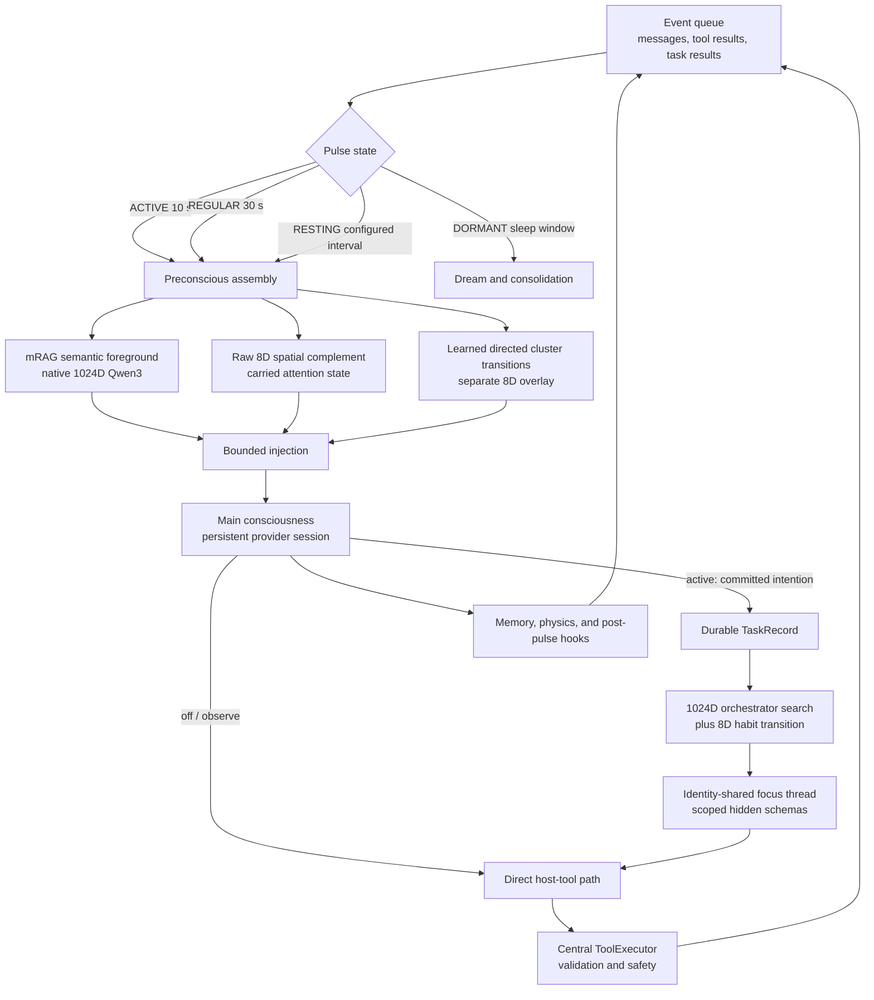

# Helix Current Technical Architecture

**Status:** canonical current architecture · **Last verified against source:** 2026-08-08 · **Applies to:** `feature/mrag-spatial-associative-memory`

This document is the shortest authoritative description of the live Helix
runtime. Historical audits and benchmark reports are intentionally not updated
to imitate this design; see the [documentation index](README.md) for their
status.

## Runtime at a Glance

## Boot and Ownership

`main.py` wires one shared `MemoryManager`, `BeliefStore`, `PhysicsEngine`,
`Preconscious`, `ToolExecutor`, provider configuration, and pulse loop. The
standard `PulseLoop` owns the conscious provider session, event queue, serial
8D attention trajectory, memory encoding, and post-pulse hooks.

`TaskCognitionController` is attached after the standard runtime exists. Focus
threads share Helix's identity, beliefs, memory corpus, semantic encoder, and
host executor, but they do not move the conscious 8D attention center or teach
memory associations. This avoids races and prevents parallel work from being
mistaken for autobiographical attention.

## Pulse State Machine

| State | Default cadence | Transition behavior |
|---|---:|---|
| `ACTIVE` | 10 seconds | Entered by an incoming user or critical event |
| `REGULAR` | 30 seconds | Entered after 2 minutes without incoming activity |
| `RESTING` | 15 minutes, config-overridable | Entered after 10 minutes in `REGULAR`; wakes immediately for events |
| `DORMANT` | 60-second wake check | Entered during the configured sleep window; runs nightly dream work |

`QUIET` and `EMERGENCE` are legacy names still present in some old comments and
audits; they are not live runtime states.

Each normal pulse drains events, captures pre-state, builds preconscious
context, calls the conscious model, stores the thought, advances physics,
captures post-state, runs hooks, and checks context lifecycle. In `off` and
`observe`, supported providers may execute a direct tool call during this
path. In `active`, the main session is thought-only and committed intentions
are completed by focused task sessions.

## Preconscious Retrieval Contract

Retrieval is deliberately separated into a precise semantic foreground and
bounded non-semantic complements. Scores from these representations are never
blended into one pseudo-distance.

| Order | Lane | Representation | Contract |
|---:|---|---|---|
| 1 | Layer-2 anchors | Named people, concepts, skills, desires | Exact high-priority anchors with repetition guard |
| 2 | mRAG foreground | Native normalized 1024D Qwen3 embeddings | Primary rank; full-trigger, sentence, RAKE, entity, concept, and relation heads plus exact-term/tag evidence |
| 3 | Raw spatial | MiniLM 384D projected through a fixed matrix to 8D | At most two spatial-only items; append-only and unable to reorder mRAG |
| 4 | Associative transition | Directed cluster prototypes in a separate 8D overlay | Repeated A→B attention transitions surface lateral follow-ons; individual memories and beliefs do not move |
| 5 | Metadata and working state | Affect, stability, Lagrangian snapshot, scratchpad, recent/contact state | Preserved for rendering, representative choice, and one bounded somatic echo |

The semantic index defaults to exact normalized dot-product search: NumPy for
small stores and FAISS `IndexFlatIP` after the automatic threshold. Optional
`IndexIVFFlat` is available through `HELIX_FAISS_MODE=ivf`. FAISS does not pick
an embedding dimension; Helix fixes the semantic contract at 1024D and FAISS
indexes those vectors.

The default semantic encoder is `qwen3-embedding:0.6b` through local Ollama.
Query and document encodings remain asymmetric where the model supports it.
The independent 384D-to-8D spatial projection remains stable so changing the
semantic model does not reposition lived memories.

Profiles control search and rendering budgets, not the representation:

| Profile | Heads | Candidate ceiling | Injection ceiling | Default rendering |
|---|---:|---:|---:|---|
| `local` | 16 | 60 | 20 items | Local summary |
| `frontier` | 32 | 160 | 32 items | Verbatim evidence |

The effective token budget also depends on average corpus item length and a
bounded fraction of the configured context window. Environment overrides are
documented near the relevant code in `core/unified_retrieval.py` and
`memory/mrag/semantic_lane.py`.

## Learned Relations and New Concepts

Helix maintains several relation types with different meanings:

| Relation | Learns from | Stored as | Used for |
|---|---|---|---|
| Semantic similarity | Text meaning at ingest/query time | 1024D vectors in `SemanticIndex` | High-accuracy retrieval and duplicate/consolidation checks |
| Spatial proximity | Stable projected position plus attention physics | Belief and memory points in separate 8D fields | Non-semantic lateral recall and attentional continuity |
| Sequential association | Repeated direct movement from foreground cluster A to B | Directed transition weights and cluster prototypes | “This tends to remind me of that” recall |
| Belief co-occurrence | Beliefs surfaced together over time | Decaying pair statistics/clusters | Nightly compound-belief candidates, not point motion |
| Explicit belief relation | Formation, consolidation, reliance, and verification | Belief metadata and category stores | Identity, people, concepts, skills, confidence, and attrition |
| Procedural relation | Successful task/tool sequences | Contextual procedural records | Biasing future task-specific capability selection |
| Situational orchestrator | Task template plus outcomes | 1024D centroids, reliability, capability counts, and 8D transitions | Selecting a learned work style for the present task |

New concepts are not a single vector-side mutation. Real-time thoughts can
produce pending outer-tier beliefs; the Curator extracts and consolidates
evidence, merges semantic overlap, synthesizes genuine co-occurrence
convergences, and precipitates dense structures into inner-tier `concepts`,
`people`, `skills`, or `desires`. The resulting record is indexed separately
into semantic 1024D and spatial 8D representations.

## Event-Driven Task Cognition

The main model receives broad ability awareness generated from the live
registry, not tool names or parameter schemas. A conservative intention
detector creates a durable `TaskRecord` only from committed first-person
intentions. The controller then:

1. Searches learned situational orchestrators with the task's 1024D template.
2. Applies a separate directed 8D habit-transition nudge.
3. Computes focus depth from novelty, uncertainty, stakes, failure history,
   confidence, and habit strength.
4. Reverse-searches the live capability registry and exposes at most a small,
   authorized schema subset to the focus session.
5. Runs bounded identity-shared work through the central `ToolExecutor`.
6. Returns the accepted outcome as a first-person `task_result` event and
   learns orchestrator reliability and contextual procedures.

Modes are `off`, `observe` (default), and `active`. Active mode currently
requires the standard pulse loop and a tool-capable `codex_cli`, Gemini, or
Anthropic provider. Unsupported combinations fall back to `observe`.

## Provider Boundaries

| Provider | Intended use | Tool behavior |
|---|---|---|
| `codex_cli` / `codex` | Continuous Helix consciousness through a local ChatGPT-authenticated Codex App Server | Host-mediated constrained actions; thought-only main session in active task mode |
| Gemini | Continuous API-backed consciousness | Provider-native function calling through `ToolExecutor` |
| Anthropic | Continuous API-backed consciousness | Provider-native tool use through `ToolExecutor` |
| Ollama | Local consciousness | Local text/tool-dispatch compatibility path; not active-task capable |
| llama.cpp | Local consciousness | Local compatibility path; not active-task capable |
| `codex_subscription` | Isolated benchmark questions only | `codex exec`; excluded from auto-detection and continuous-agent mode |

Codex built-in tools are not the authority for Helix side effects. The App
Server runs in an isolated read-only workspace; Helix validates real actions
through its own executor and availability/safety checks.

The sandboxed LongMemEval adapter follows the same boundary. Every question
gets a fresh temporary journal, semantic index, spatial field, and model
session. Historical conversations are indexed at session granularity; scorer
annotations are stripped; and the question pulse uses `learn=False`, so the
exam cannot update access, attention, associations, affect, or persistence.
If the associative lane is enabled, chronological history ingestion observes
direct session-cluster transitions before that non-teaching exam boundary.
Its generated EM, token-F1, and evidence-session recall fields are diagnostic
review aids, while the retained prediction, evidence transcript, and injected
context are the auditable record.

The RAGOffice parity sandbox is a separate controlled comparison. It snapshots
RAGOffice's generated 110-item exam, ingests all 220 source turns into one
temporary Helix mind, and uses the same local Granite reader prompt and answer
rules. Its manifest records the snapshot hash, RAGOffice commit, and dirty
source paths so the phrase “same exam” remains auditable.

## Persistence Map

| Data | Location | Update model |
|---|---|---|
| Episodic/thought journal | `data/memory/cognitive_journal.jsonl` | Append-only events with compaction |
| Belief categories | `data/beliefs/*.json` | Category stores with confidence, mass, stability, and provenance |
| Semantic vectors | `data/spatial/semantic_index*` | Rebuildable 1024D index, model identity recorded |
| Spatial state | `data/spatial/` | Two 8D fields, attention/physics state, associative transitions |
| Scratchpad | `data/scratchpad/` | Explicit working notes |
| Task cognition | `data/tasks/` | Atomic task snapshot plus audit events, orchestrators, transitions, procedures |
| Interaction ledger | `data/interaction_ledger.json` | Artifact-level action provenance |

Exact filenames can evolve; storage classes and migration code are the source
of truth for on-disk details.

## Rollout Controls

| Variable | Default | Purpose |
|---|---|---|
| `HELIX_TASK_COGNITION` | config value (`observe`) | `off`, `observe`, or `active` |
| `HELIX_UNIFIED_RAG` | enabled | Disable only for legacy retrieval fallback |
| `HELIX_MRAG_PROFILE` | `local` | `local` or `frontier` search/render budget |
| `HELIX_MRAG_RENDER_MODE` | profile default | Force `summary` or `verbatim` |
| `HELIX_ASSOCIATIVE_MEMORY` | enabled | Disable sequential association learning/recall for ablation |
| `HELIX_MRAG_ADJACENCY` | disabled | Restore old temporal-neighbor expansion for benchmark parity |
| `HELIX_SEMANTIC_MODEL` | `qwen3-embedding:0.6b` | Local semantic encoder |
| `HELIX_SEMANTIC_DIM` | `1024` | Native semantic vector dimension |
| `HELIX_FAISS_MODE` | `flat` | Exact flat or optional IVF index |

For the detailed task lifecycle, see
[`task_cognition_pipeline.md`](task_cognition_pipeline.md). For implementation
and operator detail, see the [`SYSTEM_MANUAL.md`](../SYSTEM_MANUAL.md).
