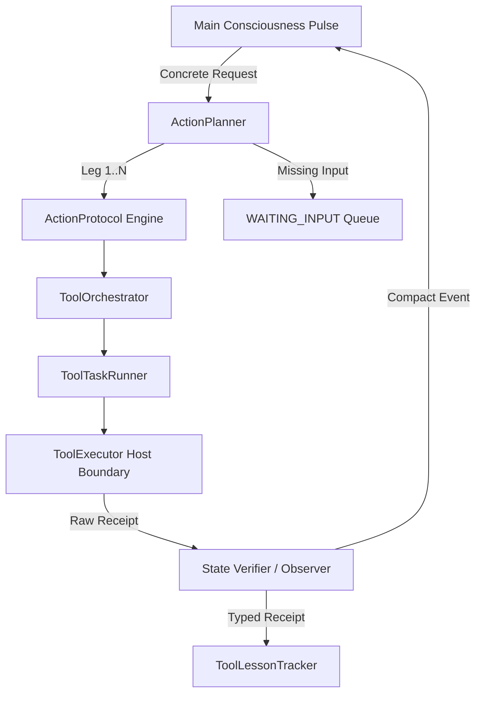

# Helix Cognitive Architecture: Action Path & Action Planner Audit

**Target Module:** `core/action_planner.py`, `core/action_protocol.py`, `core/tool_orchestrator.py`, `core/tool_task_runner.py`  
**Related Documents:** [Action Path Specification](../action_path.md)  
**Verified:** 2026-08-15  

---

## 1. Overview & Purpose

The **Action Path** subsystem decouples host execution logic and multi-step task planning from Helix's main consciousness pulse loop. Rather than cluttering the core heartbeat context window with full tool schemas, raw execution logs, and granular API protocols, Helix uses a branch-oriented planning architecture.

Main consciousness operates with identity, somatic affect, current events, bounded scratchpad notes, and brief toolset summaries. Once an action intent or user request is concrete enough to route:
1. `ActionPlanner` generates at most **4 outcome/evidence legs** or asks **one material clarification question**.
2. Each leg executes via `ToolOrchestrator` / `ToolTaskRunner` using scoped tool manifests.
3. Execution produces **authoritative receipts** (read-back verification, DOM observation, screenshot, or observer step).
4. Compact receipts feed back to main consciousness and update procedural lessons (`ToolLessonTracker`).

---

## 2. Component Breakdown



### 2.1 `ActionPlanner` (`core/action_planner.py`)
- **Responsibility:** Parses user requests into small, outcome-oriented `ActionLeg` steps (`ActionPlan`).
- **Context Ceilings:** Enforces strict context bounds:
  - Planner task text ≤ 300 tokens
  - Planner lessons ≤ 150 tokens
  - Scoped context ≤ 400 tokens
  - Maximum 4 plan legs
- **Leg Data Structure (`ActionLeg`):**
  - `toolset`: Key for required toolset (`core`, `browser`, `desktop`, `github`, `google`, `comms`).
  - `objective`: Outcome-focused target string.
  - `success_check`: Explicit condition required for verification.
  - `leg_id`: Auto-generated unique leg identifier.
- **Clarification Routing:** If essential input is missing, `ActionPlan` surfaces `question` (`NEED_INPUT:`), transitioning task state to `WAITING_INPUT`.

### 2.2 `ActionProtocol` (`core/action_protocol.py`)
- **Responsibility:** Manages step execution states, pre-condition matching, dependency ordering, and status transitions.
- **Verification Invariants:**
  - File writes require matching read-back verification.
  - Browser and GUI actions require subsequent DOM observation or screenshot.
  - Shell and git operations require observer confirmation steps.
  - Downstream legs are blocked if upstream legs are unverified.

### 2.3 `ToolOrchestrator` & `ToolTaskRunner` (`core/tool_orchestrator.py`, `core/tool_task_runner.py`)
- **Responsibility:** Handles isolated tool pass execution, schema loading, and parameter validation.
- **Pass Routing:** Runs dedicated tool passes (`llm/tool_pass.py`) outside the main session history, preventing context bloat.
- **Safety Boundary:** Translates schema invocations to `ToolExecutor`, guaranteeing host sandbox and permission whitelist checks.

---

## 3. Data Structures & Interfaces

### 3.1 `ActionLeg` Schema
```python
@dataclass(frozen=True)
class ActionLeg:
    toolset: str
    objective: str
    success_check: str
    leg_id: str = field(default_factory=lambda: f"leg_{uuid4().hex[:10]}")
```

### 3.2 `ActionPlan` Representation
```python
@dataclass
class ActionPlan:
    request: str
    legs: List[ActionLeg] = field(default_factory=list)
    question: str = ""
    error: str = ""
    prompt_tokens: int = 0
```

---

## 4. Verification & Testing

The action path implementation is verified by dedicated test suites in `tests/`:
- `tests/test_action_planner.py`: Tests line-based plan parsing, token clamping, clarification detection, and max-leg enforcement.
- `tests/test_action_protocol.py`: Tests execution leg state machine, receipt validation, and error recovery.
- `tests/run_action_path_exam.py`: 7-point integration benchmark (clarification, file write/read-back, browser observation, delivery recovery).
- `tests/run_action_path_local_smoke.py`: Virtual-world local LLM smoke test.
