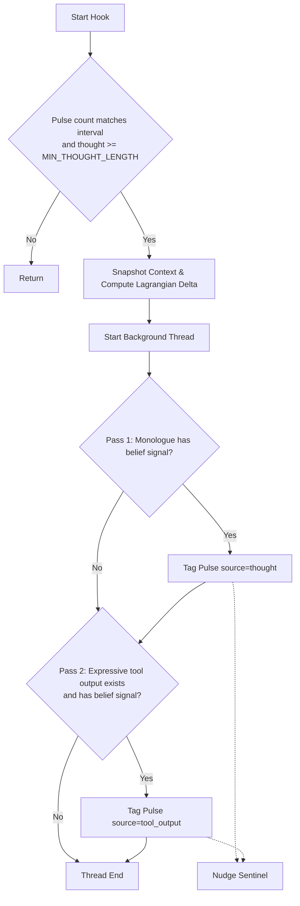

# Belief Detector Audit

**File:** `core/belief_detector.py`

---

### Overview
The Belief Detector is a **post‑pulse hook** that scans Helix's internal monologue and expressive tool outputs for genuine belief realizations. It identifies potential insights using a micro-model (`fast_classifier` GGUF) via GGUFManager, and queues the corresponding pulse information in `data/pending_beliefs.json` for detailed extraction and classification during the nightly consolidation cycle.

---

### Configuration (lines 48‑67)
```python
SCAN_INTERVAL = 1
MIN_THOUGHT_LENGTH = 100
_PENDING_FILE = Path("data/pending_beliefs.json")
MAX_PENDING = 200
_EXPRESSIVE_TOOLS = {
    "reply", "send_message", "journal", "write_file",
    "moltbook_post", "moltbook_comment", "verbalize",
}
```
* **SCAN_INTERVAL**: Evaluates thoughts every pulse.
* **MIN_THOUGHT_LENGTH**: Ignores empty or trivial monologues shorter than 100 characters.
* **_PENDING_FILE**: File path where tagged pulses are saved for nightly consolidation.
* **MAX_PENDING**: Safety ceiling (200) to prevent pending queue from growing unbounded.
* **_EXPRESSIVE_TOOLS**: Tools containing user/world-facing text that might reflect belief updates.

---

### Dependency Wiring (lines 69‑90)
```python
def set_dependencies(belief_store, physics_engine, sentinel=None, gguf_manager=None):
    global _belief_store, _physics_engine, _sentinel, _gguf_manager
    _belief_store = belief_store
    _physics_engine = physics_engine
    _sentinel = sentinel
    _gguf_manager = gguf_manager
    logger.info("Belief detector: dependencies wired")
```
* Binds the central store, physics engine, stability sentinel, and GGUF manager.
* Keeps the module decoupled; `main.py` performs concrete wiring at startup.

---

### Ollama/GGUF Signal Detection (lines 92‑135)
```python
_SIGNAL_PROMPT = (
    "Does this thought contain a GENUINE BELIEF REALIZATION — "
    "a durable insight, principle, or self-knowledge that would "
    "still be true tomorrow?\n\n"
    "NOT a belief: status updates, event narration, plans, "
    "trivial observations.\n"
    "A belief: stable self-insight, learned principle, relational "
    "understanding, procedural realization.\n\n"
    "THOUGHT:\n{text}\n\n"
    "Answer YES or NO only."
)
```
* Instructs the fast classifier to output `YES` or `NO` using GGUF grammar constraint formatting: `root ::= "YES" | "NO"`.
* Restricts response length to 2 tokens, avoiding `thinking` block timeouts and keeping inference under 0.5s.

---

### Pending Tag Management (lines 137‑220)
* **`_read_pending()` / `_write_pending()`**: Handles reading and writing metadata lists to the pending JSON file.
* **`_tag_pulse()`**: Appends a pulse tag with a unique ID, memory ID, pulse count, full thought text, expressive tool output, and an `encoding_delta` dictionary of the pulse's Lagrangian shift. It uses a thread-safe `_pending_lock` to avoid file write race conditions.
* Nudges the **StabilitySentinel** via `nudge_omega_from_event("new_belief_formed")` upon successful queuing.

---

### Core Hook Logic (lines 222‑293)
```python
def belief_detector_hook(ctx) -> None:
    # 1. Gate: only scan every SCAN_INTERVAL pulses and enough thought length.
    # 2. Snapshot thought, memory_id, pulse_count, and expressive tool outputs.
    # 3. Compute encoding_delta showing Lagrangian change before/after pulse.
    # 4. Dispatch pass check to background thread.
```
* Runs asynchronously to avoid blocking the main pulse execution loop.

---

### Background Detection execution (lines 295‑328)
* **`_run_detection()`**: Evaluates the thought monologue (Pass 1) and tool outputs (Pass 2) for belief signals.
* If either evaluates to `YES`, logs a tag in the pending beliefs.

---

### Mermaid Diagram – Belief Detector Hook Workflow


---

*End of Belief Detector audit.*
