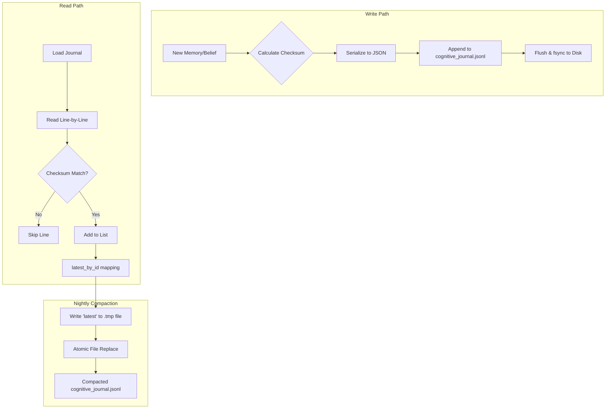

# Cognitive Journal Audit

**File:** `memory/cognitive_journal.py`

---

### Overview

The `CognitiveJournal` implements a lightweight, **append‑only JSON‑Lines (JSONL) journal**. It serves as the single source of truth for all of Helix's memories, beliefs, thoughts, and events. 

This architecture replaces the fragmented SQLite/ChromaDB persistence layer. It provides:
1. **Append-Only Immutability:** The journal is never mutated. Updates are expressed by appending a new entry with the same `id` but a newer timestamp.
2. **Atomic Writes:** Uses append-mode and file sync to ensure data integrity during writes.
3. **Integrity Checking:** Every entry receives a SHA‑256 checksum to prevent corruption.
4. **Nightly Compaction:** A maintenance routine rewrites the file, preserving only the latest version of each `id` to prevent unbounded growth.

---

### Key Constants (lines 19)

```python
DEFAULT_JOURNAL_NAME = "cognitive_journal.jsonl"
```

**Why:** Using JSONL allows line-by-line reading without loading the entire file into memory (useful for disaster recovery), while remaining fully human-readable and grep-friendly.

---

### Initialization (`__init__` lines 44-49)

- Takes a `directory` and optional `filename`.
- Ensures the target directory exists and touches the file (`self.path.touch(exist_ok=True)`) so it is immediately available for reads/writes.

---

### Core Persistence (`append` lines 54-103)

```python
entry: Dict[str, Any] = {
    "id": id,
    "type": type,
    "content": content,
    "position_8d": position_8d,
    "pulse_id": pulse_id,
    "lagrangian": lagrangian or {},
    "metadata": metadata or {},
    "timestamp": timestamp or _now_iso(),
}
entry["checksum"] = _checksum(entry)
```

- **Checksum Generation (`_checksum` lines 27-33):** Generates a SHA-256 hash of the JSON representation (sorted keys, no spaces) to act as a tamper-evident seal.
- **Atomicity (lines 99-103):** 
  - Opens in append mode (`"a"`).
  - Writes the serialized JSON line with a newline.
  - Flushes Python's buffer (`f.flush()`).
  - Forces an OS-level sync to disk (`os.fsync(f.fileno())`) to guarantee persistence even if power is lost immediately after.

**Why:** In an event-sourced cognitive architecture, ensuring that the subjective timeline of events is recorded safely is paramount. The OS-level sync prevents journal corruption.

---

### Data Retrieval (`load_all`, `latest_by_id`)

- **`load_all` (lines 105-122):** 
  - Reads the file line-by-line (oldest → newest).
  - Skips empty lines and lines that fail JSON decoding.
  - **Checksum Verification:** Pops the `checksum` key and recalculates the hash. If it doesn't match, the line is silently skipped.
- **`latest_by_id` (lines 124-133):** 
  - Scans `load_all` and stores entries in a dictionary keyed by `id`. Since the file is chronological, later appearances of the same `id` naturally overwrite older ones in the dict.

---

### Nightly Compaction (`compact` lines 138-152)

- Resolves the "latest" version of all `id`s via `latest_by_id()`.
- Writes the compacted state to a `.tmp` file.
- Uses `tmp_path.replace(self.path)` to atomically overwrite the main journal.

**Why:** Because updates are implemented as append operations, a frequently updated belief would pollute the journal with dozens of historical lines. Compaction (intended to run during the nightly "dream" cycle) keeps the footprint minimal while preserving current state.

---

### Convenience Helpers (lines 157-215)

- `append_memory`, `append_belief`, `append_thought`: Syntax sugar wrapping `append()` to automatically set the correct `type` string. 

---

### Mermaid Diagram – Journal Lifecycle



---

### Open Questions / Clarifications

> [!NOTE]
> **Checksum Skipping:** Corrupted lines are skipped silently (lines 118-120). While good for resilience, it might mask file-system degradation. Should corrupted lines trigger a warning log?

> [!WARNING]
> **Immutable History vs Compaction:** Nightly compaction destroys the historical versions of a specific `id`. If the "append-only" paradigm is meant to preserve historical thought evolution, compaction removes that history. If full history is desired, compaction should perhaps archive old lines rather than discard them.

---

*End of Cognitive Journal audit.*
