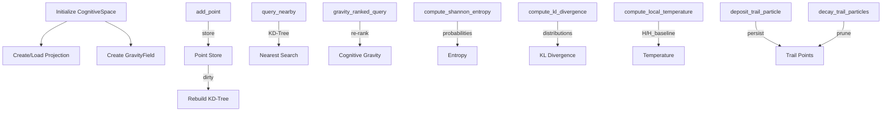

# Cognitive Space Audit

**File:** `core/cognitive_space.py`

---

### Overview
The `cognitive_space.py` module implements Helix’s **8‑dimensional spatial manifold** that unifies beliefs and memories. It provides:
1. **Deterministic projection** from high‑dimensional embeddings to an 8‑D space (`CognitiveProjection`).
2. **Gravity field** over a fixed 512‑anchor grid (`GravityField`) that quantifies where cognitive mass is concentrated.
3. **KD‑Tree indexed point store** (`CognitiveSpace`) for fast neighbor queries.
4. **Physics‑based metrics** – Shannon entropy, KL‑divergence, and temperature – derived from a Lagrangian formulation.
5. **Trail particles** that leave a trace of the attention path, pruned periodically during context compression.

The design mirrors the original Kaleidoscope E8 architecture, adapted for Helix’s belief‑graph‑centric cognition.

---

### Key Constants
```python
PROJECTION_DIM = 8          # Target dimensionality
N_ANCHORS = 512             # Fixed anchor grid size for gravity field
K_SPLAT = 8                 # Splat mass to K nearest anchors
K_QUERY_ANCHORS = 8         # Interpolate potential from K nearest anchors
KDTREE_REBUILD_THRESHOLD = 100  # Rebuild tree after this many new points
PROJECTION_SEED = 42        # Deterministic seed for reproducible positions
```
**Why:** These constants define the geometry and performance characteristics of the cognitive manifold. The deterministic seed ensures that identical embeddings always map to the same 8‑D point, guaranteeing reproducibility across sessions.

---

### `CognitiveProjection` (lines 72‑140)
- **Purpose:** Projects arbitrary high‑dimensional embeddings (e.g., a 384‑dim sentence vector) into the fixed 8‑D manifold using a **random orthogonal matrix** (Johnson‑Lindenstrauss transform).
- **Construction (`__init__` & `_build_projection_matrix` lines 72‑100):**
  - Generates a Gaussian matrix, performs QR decomposition to obtain orthogonal columns, normalizes them to unit length.
  - Deterministic via `np.random.default_rng(self.seed)`.
- **Projection (`project` lines 102‑113):** Handles mismatched dimensions by padding/truncating, then computes `embedding @ W`.
- **Batch projection (`project_batch` lines 115‑128):** Supports vectorized projection of multiple embeddings.
- **Persistence (`save`/`load` lines 130‑140):** Saves the matrix to disk; loads if present; otherwise rebuilds.

**Why:** Orthogonal projection preserves relative distances while drastically reducing dimensionality, enabling efficient KD‑Tree indexing and gravity computations.

---

### `GravityField` (lines 180‑298)
- **Anchors:** Fixed random points on the unit 8‑D sphere (`self.anchors`). Deterministic via seed offset (`seed + 1000`).
- **`compute_field` (lines 206‑250):**
  - Resets density array.
  - For each point, distributes its mass to the `K_SPLAT` nearest anchors using inverse‑distance weighting.
  - Sets `self.potential` as a copy of the accumulated density (simplified field).
- **`potential_at` (lines 259‑278):** Interpolates potential at an arbitrary 8D point (`gradient_at` was deleted in commit 1b55c50).

**Why:** The gravity field provides a continuous scalar field (`potential`) that quantifies cognitive “weight” at any location, guiding attention flow and enabling entropy/temperature calculations.

---

### `CognitiveSpace` Core (lines 327‑511)
- **Initialization (lines 327‑369):**
  - Loads or creates `CognitiveProjection`.
  - Instantiates `GravityField`.
  - Sets up point storage (`self._points`) and lazy KD‑Tree (`self._tree`).
  - Tracks pulse count and agent age.
- **Point Management (`add_point` lines 373‑416):**
  - Projects embedding to 8‑D, stores metadata (type, confidence, importance, timestamps, etc.).
  - Marks tree dirty; triggers rebuild after `KDTREE_REBUILD_THRESHOLD` additions.
- **Access/metadata updates (`update_access` line 417, `update_metadata` line 423).**
- **Query utilities (`query_nearby` lines 445‑472, `gravity_ranked_query` lines 473‑511):**
  - KD‑Tree provides fast nearest‑neighbor search.
  - `gravity_ranked_query` re‑ranks candidates by `temperature * mass / distance²` (cognitive gravity model).

---

### Cognitive Physics (Lines 528‑647)
#### Shannon Entropy (`compute_shannon_entropy` lines 528‑556)
- Retrieves `k` nearest points, normalizes gravity scores to probabilities, computes `-Σ p log₂ p`.
- Returns 0 if insufficient data.
#### KL Divergence (`compute_kl_divergence` lines 557‑610)
- Builds two distributions (current vs. identity center) from gravity scores, smooths with epsilon, computes `Σ p log(p/p*)`.
#### Local Temperature (`compute_local_temperature` lines 612‑646)
- Ratio of local entropy to baseline entropy (sampled from random anchors on first call).
- Maps to LLM generation temperature.
#### Entropy Baseline Invalidation (`invalidate_entropy_baseline` line 647)
- Resets `_mean_entropy` to `None` so it recomputes on the next call.
- **Zero API cost** — piggybacks on context compression.

---

### Trail Particles (`deposit_trail_particle` lines 658‑686)
- Persists a lightweight point of type `"trail"` at the current attention position.
- Includes `omega`, `importance`, and minimal metadata.
- Triggers KD‑Tree rebuild as needed.
- **`decay_trail_particles` (lines 670-706)**: Prunes trail particles older than `max_age_pulses` (default 200) to keep the KDTree size stable. Called during context compression in the pulse loop.

---

### Interaction Potential (Removed)
- **Status:** The `compute_interaction_potential` function (previously lines 744-798) has been **DELETED** in commit 1b55c50 as part of pruning dead/unused systems.

---

### Attention Dynamics (Euler‑Lagrange) (lines 812‑1003)
- **`step_attention`** (lines 812‑864): Integrates four forces — `F_gravity`, `F_stability`, `F_stimulus`, `F_affect` — to update position and velocity.
- **`compute_gravity_force`** (lines 875‑919): Sums inverse‑cube attractions from the K=20 nearest points, scaled by cognitive gravity.
- **`compute_stability_force`** (lines 930‑948): Hooke's law elastic pull toward identity center, scaled by Ω.
- **`_compute_stimulus_force`** (lines 959‑966): Unit‑vector pull toward the new thought/stimulus.
- **`update_gravity_field`** (lines 979‑1003): Recomputes the 512‑anchor field from all point masses.

### Structural Mass (`_compute_structural_mass` lines 1028‑1042)
```python
mass = c × (1 + n_connections / n_mean)
```
- For **beliefs**: `c = confidence`.
- For **memories/trails**: `c = importance`.
- `n_connections` = `relations_count`; `n_mean` = mean connections across all points (computed in `update_gravity_field`).

### Lorentzian Temperature (`_compute_temperature` lines 1056‑1095)
```python
T = T₀ / (1 + (pulse_age / τ)²)
```
- Phase‑dependent `T₀`: beliefs = 0.3, memories = 1.5×c, trails = 2.0×c.
- Phase‑dependent `τ`: beliefs = 60 pulses, memories = 12, trails = 8.
- `pulse_age = current_pulse − max(creation_pulse, last_accessed_pulse)` — accessing a point reheats it.

---

### Mermaid Diagram – Cognitive Space Workflow


---

*End of Cognitive Space audit.*
