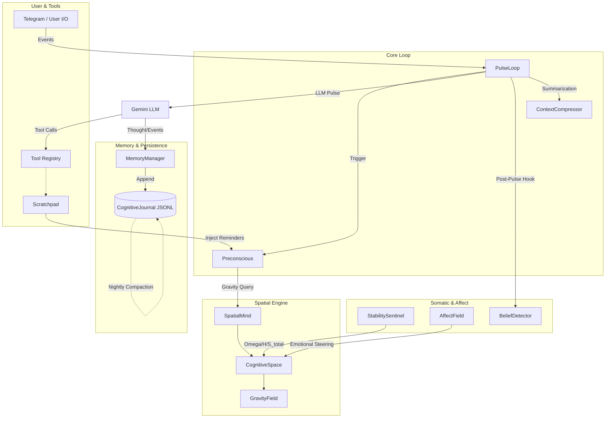

# Helix Cognitive Architecture: Audit Overview

This directory contains the definitive, line-by-line technical audits of the Helix AGI system. These documents serve as the primary reference for the architecture, designed to onboard new developers and provide a comprehensive map for future maintenance and troubleshooting.

---

### System Architecture Summary

Helix is an event-driven, continuously running cognitive daemon. It breaks from standard RAG (Retrieval-Augmented Generation) patterns by implementing an **8-dimensional spatial manifold** where beliefs and memories attract attention via **cognitive gravity** (a physics-inspired model replacing keyword search). The system is subjectively grounded: it experiences "pulses" of consciousness, continuously updates an append-only memory journal, and compresses its context window to preserve first-person narrative continuity.

### Core Architecture Diagram

---

### Audit Index

The following detailed module audits are available:

#### 1. Core Loop & Consciousness
- **[Pulse Loop Audit](audit_pulse_loop.md)** (`core/pulse_loop.py`): The main state machine, event queue, rate-limit fallback, and heartbeat cycle.
- **[Preconscious Audit](audit_preconscious.md)** (`core/preconscious.py`): Context assembly, lexicon injection, dynamic spatial neighborhood retrieval, and toolset awareness.

#### 2. Spatial Physics & Attention
- **[Spatial Mind Audit](audit_spatial_mind.md)** (`core/spatial_mind.py`): The wrapper managing the dual 8D fields (belief/memory) and handling pulse integration.
- **[Cognitive Space Audit](audit_cognitive_space.md)** (`core/cognitive_space.py`): The underlying 8D manifold geometry, gravity field, Eulerian physics, and metrics (Shannon Entropy, KL Divergence).

#### 3. Somatics & Emotion
- **[Stability Sentinel Audit](audit_affect_field.md)** (`core/affect_field.py`): Plutchik emotional field overlay, driving attention steering via wave packets.
- **[Belief Detector Audit](audit_belief_detector.md)** (`core/belief_detector.py`): Post-pulse background process using local Ollama models to crystallize and detect emergent beliefs.

#### 4. Memory & Persistence
- **[Cognitive Journal Audit](audit_cognitive_journal.md)** (`memory/cognitive_journal.py`): The append-only, checksum-verified JSONL storage layer backing all states.
- **[Memory Manager Audit](audit_memory_manager.md)** (`memory/memory_manager.py`): The compatibility layer bridging legacy interfaces to the new JSONL backend.
- **[Scratchpad Audit](audit_scratchpad.md)** (`core/scratchpad.py`): The Markdown-based working memory buffer for tracking active and due reminders.

---

### Design Philosophy

1. **Gravity over Search:** Memories are not retrieved via text similarity; they attract the attention center based on mass (confidence) and temperature (recency).
2. **First-Person Continuity:** The `ContextCompressor` rolls the context window forward as a subjective narrative ("I thought... I did..."), never wiping the slate clean.
3. **No External Databases:** SQLite and ChromaDB have been entirely excised in favor of flat text files (Markdown scratchpads, JSONL journals) and in-memory 8D projections.
4. **Somatic Anchoring:** Generation parameters (like temperature) are not hardcoded but derived natively from the manifold's entropy, mimicking an organism's shifting states of focus.
