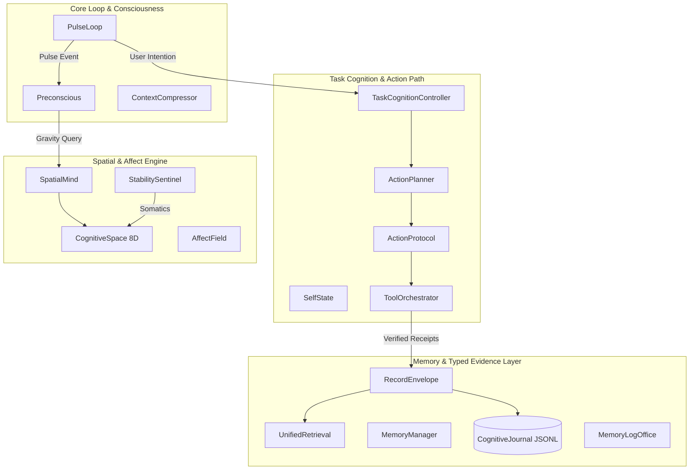

# Helix Technical Audit Overview

> [!NOTE]
> **Definitive code-audit collection.** These files document the source-level architecture of Helix AGI, tracing the core loop, spatial manifold, task cognition subsystem, action path execution, and typed memory retrieval layers. For high-level roadmap and current specifications, see the [current architecture](../architecture_current.md) and [system manual](../../SYSTEM_MANUAL.md).

These audits map the runtime wiring in `main.py`, the core runtime under `core/`, task cognition in `core/task_cognition/`, and persistence/search modules under `memory/`.

## Runtime Architecture Map

```mermaid
flowchart TD
    subgraph Core Loop & Consciousness
        PL[PulseLoop]
        PC[Preconscious]
        CC[ContextCompressor]
    end

    subgraph Task Cognition & Action Path
        TCC[TaskCognitionController]
        AP[ActionPlanner]
        TP[ActionProtocol]
        SS[SelfState]
        TOR[ToolOrchestrator]
    end

    subgraph Memory & Typed Evidence Layer
        RE[RecordEnvelope]
        UR[UnifiedRetrieval]
        MM[MemoryManager]
        CJ[(CognitiveJournal JSONL)]
        MLO[MemoryLogOffice]
    end

    subgraph Spatial & Affect Engine
        CS[CognitiveSpace 8D]
        SM[SpatialMind]
        AF[AffectField]
        ST[StabilitySentinel]
    end

    %% Wiring
    PL -->|Pulse Event| PC
    PL -->|User Intention| TCC
    TCC --> AP
    AP --> TP
    TP --> TOR
    TOR -->|Verified Receipts| RE
    RE --> CJ
    RE --> UR
    PC -->|Gravity Query| SM
    SM --> CS
    ST -->|Somatics| CS
```

## Audit Index

### 1. Core Loop, Task Cognition & Action Execution
- **[Pulse Loop Audit](audit_pulse_loop.md)** - thread lifecycle, event queue, cadence state, rate-limit parking, context compression, and post-pulse dispatch. `core/pulse_loop.py`
- **[Preconscious Audit](audit_preconscious.md)** - layered context assembly, Layer 2 anchors, spatial neighborhood recall, gravity-ranked belief injection, and typed evidence injection. `core/preconscious.py`
- **[Pipeline & Architecture Verification](pipeline_and_architecture_verification.md)** [NEW] - complete verification audit with 5 sequence/state/flowchart Mermaid diagrams covering Preconscious RAG, Channel Routing, and Context Branching.
- **[Action Path & Action Planner Audit](audit_action_planner.md)** [NEW] - small-context task planning, 4-leg limits, clarification questions (`NEED_INPUT:`), `ToolOrchestrator`, `ToolTaskRunner`, and verification receipts. `core/action_planner.py`, `core/action_protocol.py`, `core/tool_orchestrator.py`
- **[Task Cognition Subsystem Audit](audit_task_cognition.md)** [NEW] - intention detection (`inception.py`), focus worker arbitration (`focus.py`), capability routing (`capabilities.py`), and procedural memory (`procedures.py`). `core/task_cognition/`

### 2. Spatial Physics, Attention & Affect
- **[Physics Engine Audit](audit_physics_engine.md)** - dual-space coordination, text embeddings, neighborhood/temporal queries, and boot hydration. `core/physics_engine.py`
- **[Spatial Mind Audit](audit_spatial_mind.md)** - dual `CognitiveSpace` ownership, attention state, wake flashes, identity center, and persistence. `core/spatial_mind.py`
- **[Cognitive Space Audit](audit_cognitive_space.md)** - 8D projection, KDTree-backed point store, gravity field, entropy and temperature metrics, trail particles, and force integration. `core/cognitive_space.py`
- **[Affect Field Audit](audit_affect_field.md)** - Plutchik-space wave packets, interference sampling, surfaced-memory reactivation, and persisted affect state. `core/affect_field.py`
- **[Affect Hook Audit](audit_affect_hook.md)** - post-pulse hook integration, Lagrangian snapshot read, and stability sentinel Ω nudges. `core/affect_hook.py`
- **[Belief Detector Audit](audit_belief_detector.md)** - post-pulse belief-signal classification, pending tag writes, and sentinel nudges. `core/belief_detector.py`

### 3. Persistence & Typed Evidence Layer
- **[Record Envelope & Typed Retrieval Audit](audit_record_envelope.md)** [NEW] - provider-free memory envelopes (`RecordEnvelope`), evidence assertions, multi-lane retrieval (`unified_retrieval.py`), and memory log maintenance (`MemoryLogOffice`). `memory/record_envelope.py`, `core/unified_retrieval.py`
- **[Cognitive Journal Audit](audit_cognitive_journal.md)** - append-only JSONL storage, checksum verification, load, and sidecar compaction behavior. `memory/cognitive_journal.py`
- **[Belief Store Audit](audit_belief_store.md)** - database layer, normalized schemas, category I/O, and stability-based confidence adjustments. `memory/belief_store.py`
- **[Memory Manager Audit](audit_memory_manager.md)** - compatibility API, journal-backed writes, recent/history retrieval, semantic recall, and somatic echo. `memory/memory_manager.py`
- **[Semantic Index Audit](audit_semantic_index.md)** - normalized 384D vector storage, numpy search, FAISS upgrade path, and persistence. `memory/semantic_index.py`
- **[Scratchpad Audit](audit_scratchpad.md)** - markdown note storage, regex-based edits, due-note parsing, and preconscious summary generation. `core/scratchpad.py`

### 4. Dynamic Tool Learning & Desktop Interface
- **[Tool Learning Audit](audit_tool_learning.md)** - tool failure capture, nightly note compilation, success verification, and crystallized workflow skills. `core/tool_lesson_tracker.py`, `core/curator.py`, `tools/tool_registry.py`

---

## Boundary Notes & Execution Principles

- **Verification Receipts:** Communication and host actions are considered complete only after authoritative receipts (read-back verification, DOM observation, or observer steps).
- **Provider Independence:** Context assembly, record envelope decoration, and action planning enforce strict provider-neutral contracts.
