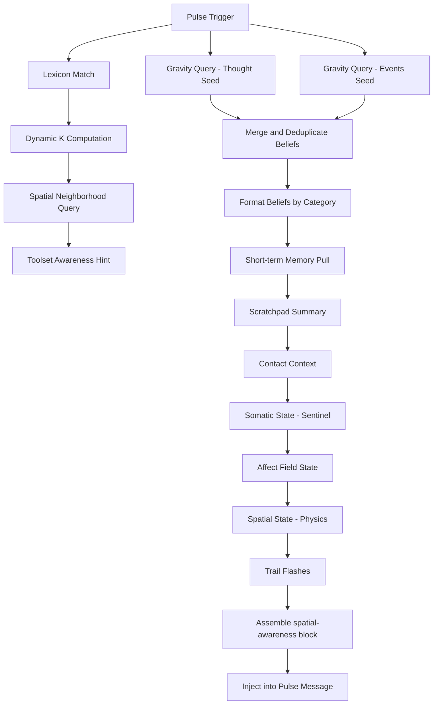

# Preconscious Audit

**File:** `core/preconscious.py`

---

### Overview

The **Preconscious** module is the bridge between the **8‑dimensional cognitive manifold** (`CognitiveSpace`) and the **conscious LLM**. On every pulse it:

1. **Embeds** the trigger text (previous thought + incoming events) into the 8‑D space via the physics engine.
2. **Queries** the gravitational neighborhood for nearby memories and beliefs (mass × temperature / distance²).
3. **Adds** temporal chain context, short‑term memory snapshots, scratch‑pad summaries, contact info, and somatic/affect state.
4. **Formats** the assembled data as a fenced `<spatial-awareness>` block that is injected into the pulse message (`PulseLoop._build_pulse_message`).

This design replaces keyword‑based retrieval with a **gravity‑driven, physics‑aware recall**, ensuring that the LLM's context is rooted in the system's current "attention center".

---

### Key Constants (lines 50‑66)

```python
# Neighborhood range — dynamically selected per-pulse based on
# manifold density.
NEIGHBORHOOD_K_MIN = 4
NEIGHBORHOOD_K_MAX = 16
# How many temporal chain entries per matched memory
CHAIN_WINDOW = 3
# Max beliefs per category to inject
BELIEFS_PER_CATEGORY = 3

# Short tool keywords that always trigger toolset awareness
SHORT_TOOL_WHITELIST = {"git", "ssh", "pip", "npm", "sql", "api", "web", "rss", "cli"}

# Gravity-ranked belief injection parameters (replaces fixed token budgets)
MAX_BELIEFS_PER_QUERY = 15   # Hard cap per seed query
MIN_BELIEFS_PER_QUERY = 2    # Always include at least the top N
```

**Why:** These parameters control how much contextual data reaches the LLM. Dynamic K scales with manifold density (denser = more candidates). Gravity‑ranked injection replaces the old fixed token budgets (200/300) — the strongest gravitational pulls are always included, with hard caps preventing runaway injection.

---

### Initialization (`__init__`, lines 68‑105)

- Stores references to **MemoryManager**, **BeliefStore**, **PhysicsEngine**, optional **Scratchpad**, **ChannelRouter**, and **StabilitySentinel**.
- Shares the PulseLoop's active toolset via `self._active_toolsets`.
- Sets up **belief cache** (`_belief_cache`, `_belief_cache_count`, `_belief_cache_mass`) for fast 8‑D lookup.
- Tracks previous‑pulse beliefs in `_prev_pulse_beliefs` (rolling 3‑pulse window) to avoid repeating the same beliefs in consecutive pulses.
- Prepares **lexicon** lookup/blacklist (`_lexicon_lookup`, `_lexicon_blacklist`).

---

### Lexicon System (`_load_lexicon` lines 107‑135, `_pull_lexicon_matches` lines 275‑328)

- Reads `lexicon.json` from the belief store's data directory.
- Builds a case‑insensitive `term → entry` mapping (includes aliases).
- On each pulse, performs **word‑boundary regex matching** against the trigger text.
- Matched summaries are injected **first** (before any gravity query) and **blacklisted** for the remainder of the context window.
- `reset_lexicon_blacklist()` (line 330) is called from `PulseLoop._compress_context` and `_reset_session` to re‑enable entries after compression.
- **Fallback:** If `lexicon.json` fails to load, the system silently falls through to normal spatial + gravity queries. The lexicon is purely additive.

---

### Main Injection Pipeline (`inject` lines 139‑271)

| Step | Method | Description |
|------|--------|-------------|
| **0** | `_pull_lexicon_matches` | Fast regex term detection; blacklisted after injection. |
| **1** | `_pull_spatial_neighborhood` | Gravity field query with dynamic K (4–16 based on density). |
| **1b** | `_toolset_awareness` | Keyword matching against unloaded toolsets, including `SHORT_TOOL_WHITELIST`. |
| **2** | `_pull_relevant_beliefs` | Two gravity queries (thought seed + events seed), gravity‑ranked, merged, deduplicated. |
| **3** | `_pull_recent_memory` | Last 3 short‑term memories (≤ 10 min). |
| **4** | Scratchpad | Current scratchpad summary if available. |
| **5** | `_pull_contact_context` | Contact channel/last‑contact info if a name appears in trigger. |
| **6** | `_pull_somatic_state` | Stability sentinel metrics (Ω, S_total, entropy, mode). |
| **6b** | `_pull_affect_state` | Plutchik affect field (dominant affect, intensity, surfaced memories). |
| **7** | Spatial state | Physics cues (gamma, velocity_mag, identity_dist). |
| **8** | Trail flashes | Up‑to‑3 recent trail particles. |
| **Wrap** | — | All parts concatenated, wrapped in `<spatial-awareness>` fences. |

---

### Dynamic Neighborhood K (`_compute_dynamic_k` lines 586‑611)

```python
density_ratio = active_anchors / total_anchors
K = K_MIN + density_ratio × (K_MAX - K_MIN)
```

- Uses the gravity field's active anchor count (potential > 0.01) as a density proxy.
- Scales linearly between `NEIGHBORHOOD_K_MIN` (4) and `NEIGHBORHOOD_K_MAX` (16).
- The existing `TARGET_BUDGET = 500` token cap in `_pull_spatial_neighborhood` still acts as the hard limit on what actually gets injected — a larger K just considers more candidates.
- Falls back to `NEIGHBORHOOD_K_MIN` on any error.

**Why:** In dense manifold regions there may be 20+ relevant points. In sparse regions, even 6 may include noise. Dynamic K adapts the query width to the manifold's current state.

---

### Spatial Neighborhood (`_pull_spatial_neighborhood` lines 613‑688)

- Calls `physics.query_neighborhood` with the dynamic K.
- Formats results with relevance‑based tags (`vivid recall` > 5.0, `related` > 1.0, `faint`).
- Adds **temporal chains** for high‑relevance items (see below).
- If the cluster has ≥ 4 items, attempts a **forked reflection** via local Ollama (`_reflect_on_cluster`).

### Temporal Chain Window

When the preconscious finds a highly relevant memory (relevance > 5.0), it asks: "what happened **before and after** this memory?"

1. The matched memory has a `creation_pulse` (e.g., pulse 450).
2. `query_temporal_chain(anchor_pulse=450, window=3)` scans both belief and memory spaces for any point whose `creation_pulse` is within ±3 of 450 (excluding 450 itself).
3. Results are sorted chronologically and labeled `(before: …)` or `(after: …)`.

This stitches a short narrative around recalled memories, giving the LLM temporal context for strong matches.

---

### Toolset Awareness (`_toolset_awareness` lines 468‑520)

- Queries `tools.tool_registry.get_toolset_info` for available but unloaded toolsets.
- Extracts keywords from tool names (`github_search` → `github`, `search`).
- Matches keywords > 3 chars **plus** any keyword in `SHORT_TOOL_WHITELIST` against neighborhood content.
- Returns a pipe‑separated hint string.

**Why:** The whitelist (`git`, `ssh`, `pip`, etc.) ensures that short but important tool names always trigger awareness hints, bypassing the generic 3‑char length filter.

---

### Gravity‑Ranked Belief Injection (`_gravity_query` lines 727‑759)

```python
gravity = mass / (dist_sq + 1e-4)
# Sort by gravity descending — strongest pulls first
# Take the top max_results (default 15), guarantee min_results (default 2)
```

- Scores each cached belief by cognitive gravity against the seed text's 8‑D position.
- Simply takes the top N by gravity — no percentile floor needed.
- The gravity ranking itself is the filter; `max_results` provides the cap.

**Why:** Fixed token budgets were a crude proxy that could include low‑mass noise or exclude high‑mass verbose beliefs. Gravity ranking ensures the strongest pulls always surface, and the hard cap prevents runaway injection.

### Two‑Seed Belief Pull (`_pull_relevant_beliefs` lines 835‑875)

1. **Thought seed** → gravity query (max 15 results).
2. **Events seed** → gravity query (max 15 results, excluding thought‑seed results).
3. **Merge** → deduplicate (heavier wins on > 60% word overlap).
4. **Format** → category‑specific tags (`I am:`, `I understand:`, `I want:`, etc.).
5. **Track** → surfaced content added to `_prev_pulse_beliefs` (rolling 3‑pulse window).

---

### Belief Cache (`_ensure_belief_cache` lines 680‑726)

- Embeds all beliefs once using `physics.embed_and_project`.
- Rebuilds when belief count **or total mass** changes (catches merges, attrition, confidence decay).
- **Does NOT rebuild on compression** — compression only affects the LLM's chat history, not the belief store.

---

### Somatic & Affect Awareness

- **Somatic** (`_pull_somatic_state` lines 343‑387): Reads sentinel Ω, S_total, entropy, mode; maps to qualitative label.
- **Affect** (`_pull_affect_state` lines 391‑442): Pulls dominant Plutchik affect, intensity, novelty signal, and emotionally surfaced memories from `core.affect_hook`.

---

### Mermaid Diagram – Preconscious Workflow



---

### Prompt‑Injection Example

When `PulseLoop._build_pulse_message` assembles the final prompt, the preconscious block appears as:

```
<spatial-awareness>
[Recalled context — NOT new input. Background orientation from the spatial mind.]

(lexicon — Helix: autonomous cognitive daemon)
(vivid recall: remembered the 8D manifold projection technique)
  (before: was discussing gravity models)
  (after: started implementing the KD-Tree index)
(related: user asked about sentiment analysis)
(I understand: the system uses a Shannon entropy metric)
(I am: an autonomous cognitive daemon)
(stability: Ω=0.73 — good | S=0.45 | H=1.28 | mode=tonic)
(affect: joy | intensity=0.62 | packets=3)
(git tools available — version control and repository management)
(attention shifting rapidly)
(trail: ⟪pulse_1023⟫ | ⟪pulse_1022⟫)
</spatial-awareness>
```

---

### Open Questions / Clarifications

> [!IMPORTANT]
> **Forked Reflection (`_reflect_on_cluster`):** Currently uses local Ollama (Granite 4.1:8b). May be better handled by the main conscious model when it loops too long. Deferred for later design discussion.

> [!NOTE]
> **Dynamic Affordance Threshold:** `compute_interaction_potential` uses a fixed threshold of 0.5. A relative threshold based on recent tool usage statistics would be more adaptive, but no design has been finalized yet.

---

*End of Preconscious audit.*
