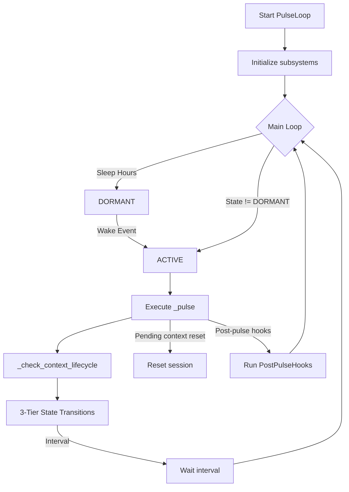

# Pulse Loop Audit

**File:** `core/pulse_loop.py`

---

### Overview
The `PulseLoop` class implements Helix’s **event‑driven consciousness engine**. It coordinates:
1. **State machine** (`DORMANT`, `RESTING`, `ACTIVE`, `REGULAR`).
2. **Event queue** for user messages, tool results, and system notifications.
3. **Pre‑conscious injection** of spatial context and belief seeds.
4. **LLM interaction** (Gemini with native function‑calling). 
5. **Post‑pulse hooks** for background tasks (e.g., belief consolidation, nightly dream cycle).
6. **Context‑window lifecycle** via a rolling compressor rather than hard resets.
7. **Rate‑limit handling** with fallback model parking.

---

### Key Constants (lines 61‑78)
```python
61-78: # Pulse intervals (seconds) — 3‑tier gradient
62: ACTIVE_INTERVAL = 10       # fast response during conversation
63: REGULAR_INTERVAL = 30      # autonomous work cadence
64: RESTING_INTERVAL = 900     # idle background presence (15 min)
65: DORMANT_CHECK = 60         # poll interval while sleeping
66: # Timeout durations for state transitions
67: ACTIVE_TIMEOUT = 120       # → REGULAR after 2 min no inbound
68: REGULAR_TIMEOUT = 600      # → RESTING after 10 min inactivity
69: # Context window lifecycle thresholds
70: FOCUS_DRIFT_THRESHOLD = 1.5
71: TOKEN_WARNING_STEP = 500_000  # inject warning when > ≈ 500k tokens
```
**What:** Defines cadence, sleep schedule, and thresholds.
**Why:** Enables Helix to adapt pulse frequency based on user activity and to avoid runaway token growth.

---

### Initialization (lines 79‑180)
- Stores references to core subsystems (`memory_manager`, `belief_store`, `physics_engine`, `preconscious`, `scratchpad`).
- Loads tool schema path (`self._tool_modes_path`).
- Detects LLM provider and logs chosen model.
- Creates journal directory, callbacks, sentinel, and initializes state variables (`_state`, `_pulse_count`, timers). 
- Sets up **dynamic toolset** tracking (`self._active_toolsets = {"core"}`) and shares it with `preconscious` (line 179).
- Prepares placeholders for consolidation, dream cycles, and rate‑limit flags.

---

### Lifecycle Control (methods `start`, `stop`, `wake`)
- `start` spawns a daemon thread running `_main_loop` and sets initial state based on sleep hours.
- `stop` clears the running flag and forces a wake event.
- `wake` forces transition to `ACTIVE` from any non‑active state, resetting idle‑consolidation flag.

---

### Event Injection (`emit` / `_translate_event`)
- `emit` converts a structured event into a natural‑language string via `_translate_event` and appends it to a thread‑safe queue.
- Updates timestamps (`_last_event_time`, `_last_incoming_time`, `_last_activity_time`) and nudges the **StabilitySentinel** on incoming messages.

---

### Main Loop (`_main_loop` – lines 330‑487)
1. **Sleep Schedule** – if within `SLEEP_START`‑`SLEEP_END`, state forced to `DORMANT` and nightly tasks (pending belief processing, dream cycle) are launched once per night.
2. **Rate‑limit Gate** – when `_rate_limited` is true, forces fallback model (`gemini-3.1-flash-lite-preview`).
3. **Pulse Execution** – calls `self._pulse()` then `_check_context_lifecycle()`.
4. **State Transitions** – moves `ACTIVE → REGULAR` after `ACTIVE_TIMEOUT`, and `REGULAR → RESTING` after `REGULAR_TIMEOUT`.
5. **Idle Consolidation** – after 2 h of inactivity in `RESTING`, spawns a background belief‑consolidation pass.
6. **Wait for Next Interval** – selects interval based on current state and waits on `_wake_event`.

---

### Context Lifecycle (`_check_context_lifecycle` – lines 486‑527)
- **Focus drift** is logged when the Euclidean distance between current attention center and session focus origin exceeds `FOCUS_DRIFT_THRESHOLD` (no compression triggered).
- **Token‑based compression**: uses `ContextCompressor.should_compress`. In `ACTIVE`, compression is suppressed unless the token count exceeds the emergency threshold.
- **Token warning**: sets `_token_warning` for inclusion in the next pulse message when token count > `TOKEN_WARNING_STEP`.

---

### Context Compression (`_compress_context` – lines 528‑576)
- Retrieves chat history via `self._chat.get_history()`.
- Calls `self._compressor.compress` with the current spatial state.
- Replaces the session history if compression yields a shorter list, resets token count, and clears the lexicon blacklist.
- **Invalidates entropy baseline** in both belief and memory spaces (lines 568‑569) so that `compute_local_temperature` recomputes its baseline from the current manifold state.
- Logs the compression outcome.

---

### Pulse Execution (`_pulse` – lines 578‑800)**
1. **Snapshot sentinel state** before the pulse (`lagrangian_before`).
2. **Drain events** from the queue.
3. **Pre‑conscious injection** (`self.preconscious.inject`) – provides `preconscious_context` and list of injected belief IDs.
4. **Build pulse message** (`_build_pulse_message`).
5. **Send to LLM** (`_send_pulse`).
6. **Rate‑limit handling** – parses `429 RESOURCE_EXHAUSTED` in the returned thought, updates counters (`_consecutive_429s`, `_fallback_successes`, `_restore_failures`), switches models, and may hard‑lock to fallback until morning.
7. **Parse output** (`_parse_output`) – currently a stub for backward compatibility.
8. **Queue tool results** as events for the next pulse.
9. **Log tool usage** and reset activity timers.
10. **Track token count** from the chat session.
11. **Store events and thought** in `MemoryManager` with attached Lagrangian snapshots and 8‑D position vectors.
12. **Update physics** (`self.physics.step_pulse`).
13. **Callback notification** (`_thought_callback`).
14. **Handle pending context reset** – rebuilds session and injects optional prompt.
15. **Run post‑pulse hooks** (`core.post_pulse_hooks.run_hooks`).

---

### Post‑Pulse Hook Invocation (lines 808‑842)
- Imports `PostPulseHookContext` and `run_hooks`.
- Captures tool calls, sentinel state after the pulse, and constructs a context object containing:
  - Thought, events, pulse count, tool calls, spatial state, active toolsets, memory ID, before/after Lagrangian snapshots, and injected belief IDs.
- `run_hooks` executes all registered hooks; errors are logged but never crash the loop.

---

### Message Building (`_build_pulse_message` – lines 843‑874)
- Starts with a header `[Pulse {count} — {timestamp}]`.
- Appends token warning if present.
- Includes pre‑conscious context (wrapped in `<spatial-awareness>` fences by `Preconscious`).
- Lists new events or notes `No new events.`
- Falls back to the previous thought snippet when there are no events.

---

### Chat Session Management (`_ensure_session`, `_build_system_instruction`, `_load_all_tools`, `_send_pulse`)
- `_ensure_session` lazily creates a `ChatSession` using provider config, system instruction, and tool declarations.
- Tool declarations are loaded either via the registry (`tools.tool_registry`) or static fallback (`tools.tool_declarations`).
- System instruction (lines 942‑1020) composes identity preamble, core identity beliefs, deep knowledge beliefs, and communication/action guidance.
- `_send_pulse` ensures the session exists, rebuilds tool declarations if `_pending_toolset_rebuild` is set, and forwards the assembled message to the LLM.

---

### Output Parsing (`_parse_output` – lines 1094‑1101)
- Currently a placeholder (`pass`). All tool interactions are handled via native function calling, making text‑tag parsing obsolete.

---

### Status Interface (`state` property, `get_status`)
- Provides current state, pulse count, chat character count, event queue size, provider/model info, and a snippet of recent thoughts.

---

### Mermaid Diagram – Pulse Loop Workflow

The diagram captures the high‑level state machine, pulse execution, context handling, and hook integration.

---

### Prompt‑Injection Example
During `_pulse`, `preconscious.inject` returns a string such as:
```
<spatial-awareness>
BELIEF: I realize my quiet periods are actually deep integration phases. CATEGORY: self_identity
</spatial-awareness>
```
This block is inserted into the pulse message (line 858) and becomes part of the LLM prompt, allowing emotions or newly‑queued beliefs to directly influence the next thought.

---

### Open Questions / Clarifications
- **Dynamic Interval Tuning:** The fixed intervals (`ACTIVE_INTERVAL`, `REGULAR_INTERVAL`, `RESTING_INTERVAL`) are static. Would exposing them via a runtime configuration improve adaptability to different workloads?
- **Focus‑Drift Handling:** Currently drift is only logged. Should exceeding `FOCUS_DRIFT_THRESHOLD` ever trigger context compression or a reset to maintain cognitive coherence?
- **Post‑Pulse Hook Errors:** Errors are logged but ignored. Do we need a retry or escalation strategy for critical hooks (e.g., belief consolidation) that might fail silently?
- **Rate‑Limit Policy:** The hard‑lock to fallback until morning may cause prolonged degraded performance. Might a more granular exponential back‑off be preferable?
- **Context Compression Metrics:** `ContextCompressor` decides based on token count. Would incorporating semantic similarity metrics (e.g., embedding overlap) yield smarter compression?

---

*End of Pulse Loop audit.*

---

*This file now contains the full line‑by‑line audit for `core/pulse_loop.py`.*
