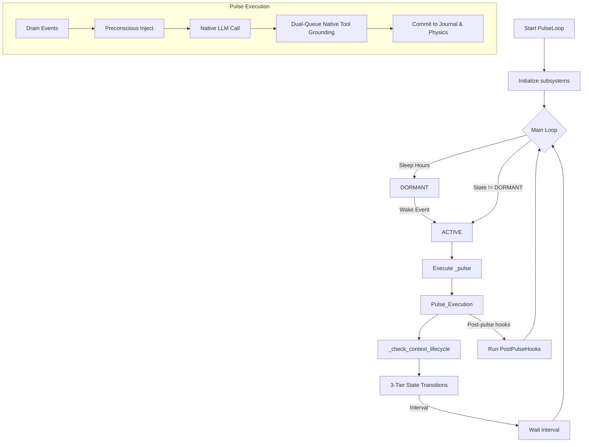

# Pulse Loop Audit

**File:** `core/pulse_loop.py`

---

### Overview
The `PulseLoop` class implements Helix’s **event‑driven consciousness engine**. It coordinates:
1. **State machine** (`DORMANT`, `RESTING`, `ACTIVE`, `REGULAR`).
2. **Event queue** for user messages, tool results, and system notifications.
3. **Pre‑conscious injection** of spatial context and belief seeds.
4. **LLM interaction** via a Dual-Queue Native Tool Architecture (Gemini).
5. **Post‑pulse hooks** for background tasks (e.g., belief consolidation, nightly dream cycle).
6. **Context‑window lifecycle** via a rolling compressor rather than hard resets.
7. **Rate‑limit handling** with fallback model parking.

---

### Key Constants (lines 61‑78)
```python
# Pulse intervals (seconds) — 3‑tier gradient
ACTIVE_INTERVAL = 10       # fast response during conversation
REGULAR_INTERVAL = 30      # autonomous work cadence
RESTING_INTERVAL = 900     # idle background presence (15 min)
DORMANT_CHECK = 60         # poll interval while sleeping
# Timeout durations for state transitions
ACTIVE_TIMEOUT = 120       # → REGULAR after 2 min no inbound
REGULAR_TIMEOUT = 600      # → RESTING after 10 min inactivity
# Context window lifecycle thresholds
FOCUS_DRIFT_THRESHOLD = 1.5
TOKEN_WARNING_STEP = 500_000  # inject warning when > ≈ 500k tokens
```
**What:** Defines cadence, sleep schedule, and thresholds.
**Why:** Enables Helix to adapt pulse frequency based on user activity and to avoid runaway token growth.

---

### Initialization (lines 79‑180)
- Stores references to core subsystems (`memory_manager`, `belief_store`, `physics_engine`, `preconscious`, `scratchpad`).
- Loads tool schema path (`self._tool_modes_path`).
- Detects LLM provider and logs chosen model.
- Creates journal directory, callbacks, sentinel, and initializes state variables (`_state`, `_pulse_count`, timers). 
- Sets up **dynamic toolset** tracking (`self._active_toolsets = {"core"}`) and shares it with `preconscious`.
- Prepares placeholders for consolidation, dream cycles, and rate‑limit flags.

---

### Lifecycle Control (methods `start`, `stop`, `wake`)
- `start` spawns a daemon thread running `_main_loop` and sets initial state based on sleep hours.
- `stop` clears the running flag and forces a wake event.
- `wake` forces transition to `ACTIVE` from any non‑active state, resetting idle‑consolidation flag.

---

### Event Injection (`emit` / `_translate_event`)
- `emit` converts a structured event into a natural‑language string via `_translate_event` and appends it to a thread‑safe queue.
- Updates timestamps (`_last_event_time`, `_last_incoming_time`, `_last_activity_time`) and nudges the **StabilitySentinel** on incoming messages.

---

### Main Loop (`_main_loop` – lines 330‑487)
1. **Sleep Schedule** – if within `SLEEP_START`‑`SLEEP_END`, state forced to `DORMANT` and nightly tasks (pending belief processing, dream cycle) are launched once per night.
2. **Rate‑limit Gate** – when `_rate_limited` is true, forces fallback model.
3. **Pulse Execution** – calls `self._pulse()` then `_check_context_lifecycle()`.
4. **State Transitions** – moves `ACTIVE → REGULAR` after `ACTIVE_TIMEOUT`, and `REGULAR → RESTING` after `REGULAR_TIMEOUT`.
5. **Idle Consolidation** – after 2 h of inactivity in `RESTING`, spawns a background belief‑consolidation pass.
6. **Wait for Next Interval** – selects interval based on current state and waits on `_wake_event`.

---

### Context Lifecycle (`_check_context_lifecycle` – lines 486‑527)
- **Focus drift** is logged when the Euclidean distance between current attention center and session focus origin exceeds `FOCUS_DRIFT_THRESHOLD` (no compression triggered).
- **Token‑based compression**: uses `ContextCompressor.should_compress`. In `ACTIVE`, compression is suppressed unless the token count exceeds the emergency threshold.
- **Token warning**: sets `_token_warning` for inclusion in the next pulse message when token count > `TOKEN_WARNING_STEP`.

---

### Pulse Execution (`_pulse` – lines 583‑800)
1. **Snapshot sentinel state** before the pulse (`lagrangian_before`).
2. **Drain events** from the queue.
3. **Pre‑conscious injection** (`self.preconscious.inject`) – provides `preconscious_context` and list of injected belief IDs.
4. **Build pulse message** (`_build_pulse_message`).
5. **Send to LLM** (`_send_pulse`).
6. **Rate‑limit handling** – parses `429 RESOURCE_EXHAUSTED` in the returned thought, switches models, and may hard‑lock to fallback.
7. **Dual-Queue Tool Grounding**: Uses `self._chat.get_pending_tool_results()` to extract stringified native tool responses, and emits them as `tool_result` events into the queue. This bridges the gap between invisible native API function returns and the internal monologue/cognitive journal.
8. **Log tool usage** and reset activity timers.
9. **Track token count** from the chat session.
10. **Store events and thought** in `MemoryManager` with attached Lagrangian snapshots and 8‑D position vectors.
11. **Update physics** (`self.physics.step_pulse`).
12. **Handle pending context reset** – rebuilds session and injects optional prompt.
13. **Run post‑pulse hooks** (`core.post_pulse_hooks.run_hooks`).

---

### Output Parsing (`_parse_output` – lines 1094‑1101)
- Currently a placeholder (`pass`). All tool interactions are handled via the Native Tool Calling architecture. The dual-queue system has rendered legacy text-tag parsing obsolete while preserving episodic memory grounding.

---

### Mermaid Diagram – Pulse Loop Workflow


---

### Open Questions / Clarifications
- **Dynamic Interval Tuning:** The fixed intervals are static. Would exposing them via a runtime configuration improve adaptability to different workloads?
- **Rate‑Limit Policy:** The hard‑lock to fallback until morning may cause prolonged degraded performance. Might a more granular exponential back‑off be preferable?
- **Tool Result Event Injection:** Since `tool_result` events are now emitted to the queue, they are explicitly injected via the Preconscious on the *subsequent* pulse. Ensure complex tool chains aren't broken by this asynchronous 1-pulse lag.

---

*End of Pulse Loop audit.*
