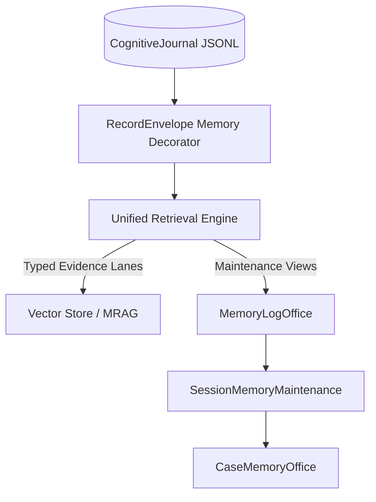

# Helix Cognitive Architecture: Record Envelope & Typed Retrieval Audit

**Target Modules:** `memory/record_envelope.py`, `core/unified_retrieval.py`, `core/memory_log_office.py`, `core/session_memory_maintenance.py`, `core/case_memory_office.py`  
**Verified:** 2026-08-15  

---

## 1. Overview & Purpose

The **Record Envelope** layer provides a provider-free, deterministic evidence envelope for all canonical Helix memory records. While `CognitiveJournal` remains append-only and canonical, `RecordEnvelope` decorates each journal record with explicit metadata describing:
- What the record represents (`thought`, `inbound_message`, `outbound_message`, `tool_call`, `tool_result`, `task_outcome`).
- Supporting evidence assertions and entity provenance.
- Retrieval phrasing optimized for semantic search without modifying stored journal history.

---

## 2. Component Audits

### 2.1 `RecordEnvelope` (`memory/record_envelope.py`)
- **Schema Version:** `RECORD_SCHEMA_VERSION = 1`
- **Classifications:**
  - `THOUGHT_KINDS`: Internal reflections and cognitive pulses (`thought`).
  - `COMMUNICATION_KINDS`: Relational exchanges (`inbound_message`, `outbound_message`).
  - `ACTION_EVIDENCE_KINDS`: Verifiable host interactions (`tool_call`, `tool_result`, `tool_observation`, `task_outcome`).
- **Legacy Compatibility:** Legacy records persisted in existing `.jsonl` files are dynamically classified without requiring journal rewrites.

### 2.2 `UnifiedRetrieval` (`core/unified_retrieval.py`)
- **Typed Retrieval Lanes:** Routes query resolution across dedicated evidence lanes:
  - Epistemic Belief Lane (gravitational mass and confidence)
  - Action Evidence Lane (tool execution receipts and verified outcomes)
  - Communication Lane (user dialog history and contact profile context)
- **Evidence Weighting:** Ranks retrieved records by combining semantic proximity, temporal recency, and verification confidence.

### 2.3 Memory Office Maintenance System (`core/memory_log_office.py`, `core/session_memory_maintenance.py`, `core/case_memory_office.py`)
- **`MemoryLogOffice`:** Maintains canonical view catalogs, session log summaries, and catalog indexes.
- **`SessionMemoryMaintenance`:** Runs background maintenance routines to link related session events, extract candidate entity facts, and flag stale indices.
- **`CaseMemoryOffice`:** Groups entity-specific facts into entity case files for long-term relational tracking.

---

## 3. Verification & Testing

- `tests/test_memory_record_envelope.py`: Tests envelope classification, tag parsing, payload cleaning, and serialization.
- `tests/test_unified_retrieval.py`: Tests typed evidence retrieval across multi-lane queries.
- `tests/test_case_memory_office.py` & `tests/test_memory_intake_office.py`: Test entity case management and intake work orders.
