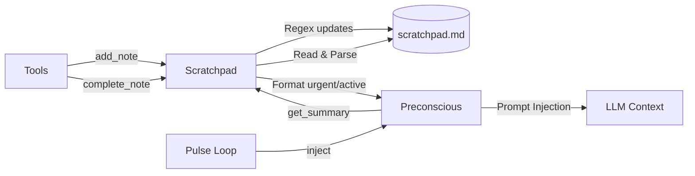

# Scratchpad Audit

**File:** `core/scratchpad.py`

---

### Overview

The `Scratchpad` module implements a plain-text, Markdown-based notepad for Helix. It functions as the "conscious memory" or working memory buffer.

Instead of hiding state in JSON or SQLite databases, the scratchpad uses a literal `scratchpad.md` file. The LLM reads and writes to this file using the same format a human would. The preconscious pipeline automatically parses this file during every pulse to surface urgent reminders and active notes into Helix's peripheral awareness.

---

### Initialization (`__init__` lines 34-40)

- Takes a `data_dir` and resolves to `scratchpad.md`.
- If the file does not exist, it creates it with a simple `# Scratchpad\n\n` header via `_write_initial`.

---

### File Operations (`_read`, `_write` lines 47-58)

- Very simple wrapper around `open()`.
- Reads the entire file into a string.
- Writes the entire string back to the file.
- If reading fails, returns the default header.

**Why:** Keeping it as a single flat string operation is fast enough for small notepad files and avoids complex locking mechanisms.

---

### Note Management (lines 62-164)

The core mechanic relies on standard Markdown task-list syntax: `- [ ]` for active, `- [x]` for completed. Notes are appended with a unique ID and timestamp.

- **`add_note` (lines 62-83):** 
  - Generates a short ID based on the current timestamp: `f"n{int(datetime.now().timestamp()) % 100000}"`.
  - Appends the note: `- [ ] (n12345) Content... [due: 2026-05-20]  ← 2026-05-19 14:00`.
- **`complete_note` (lines 85-103):** 
  - Normalizes the ID (prepends `n` if missing).
  - Uses Regex: `re.subn(rf"- \[ \] \({re.escape(nid)}\)", f"- [x] ({nid})", text, count=1)`.
- **`remove_note` (lines 105-121):** 
  - Splits text into lines and filters out the line containing `({nid})`.
- **`update_note` (lines 123-140):** 
  - Uses Regex to match the existing line (whether checked or not) and replaces the content and timestamp while preserving the ID and check state.
- **`clear_completed` & `clear_all` (lines 142-164):** 
  - Filters lines based on starting with `- [x]` or `- [` respectively.

---

### Queries (`get_active_notes`, `get_due_notes`, `get_summary` lines 168-215)

- **`get_active_notes` (lines 168-182):** 
  - Uses a complex Regex to extract the ID, content, optional `due_at` string, and creation timestamp from all `- [ ]` lines.
- **`get_due_notes` (lines 184-188):** 
  - Filters active notes where `due_at` is present and less than or equal to the current ISO timestamp (`_now_iso()`).
- **`get_summary` (lines 190-215):** 
  - Called by `preconscious.py`.
  - Formats **due notes** prominently: `(REMINDER DUE: ...)`
  - Formats **active notes** as excerpts: `(scratchpad: 3 active note(s): excerpt1; excerpt2...)`. Capped at 3 excerpts to save tokens.

---

### Mermaid Diagram – Scratchpad Flow



---

### Prompt‑Injection Example

During `_pulse`, `preconscious.inject` calls `scratchpad.get_summary()` and embeds the result into the `<spatial-awareness>` block:

```
<spatial-awareness>
...
(REMINDER DUE: Follow up on the database migration)
(scratchpad: 2 active note(s): Need to fix the Sentinel metrics; Draft the email to Sarah)
...
</spatial-awareness>
```

This keeps Helix's "to-do" list constantly visible in its peripheral vision without requiring an explicit tool call to read it.

---

### Open Questions / Clarifications

> [!NOTE]
> **Regex Brittleness:** The `update_note` and parsing regexes rely on strict formatting. If the LLM uses a tool to append text that happens to match the regex or manually edits the markdown file (if it has file-edit tools), it could break the parser.

> [!WARNING]
> **Timestamp Collision:** `add_note` generates IDs using `int(datetime.now().timestamp()) % 100000`. If two notes are added within the same second, they will have the exact same ID, causing `complete_note` or `update_note` to affect the wrong note or fail.

---

*End of Scratchpad audit.*
