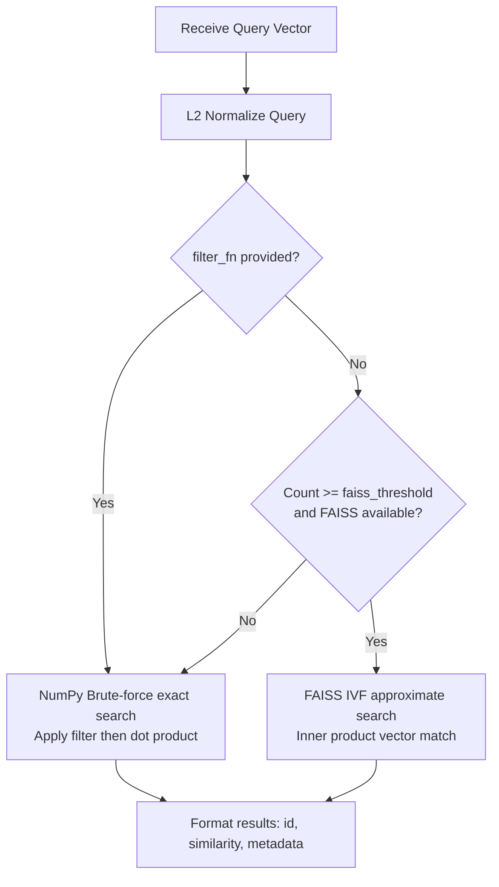

# Semantic Index Audit

**File:** `memory/semantic_index.py`

---

### Overview
The `SemanticIndex` is the conscious mind's library catalog. It performs exact semantic vector search on uncompressed 384D embeddings (using the `all-MiniLM-L6-v2` model). It is explicitly called during conscious recall requests (`memory_recall` tool) or by the Curator during nightly sleep-cycle consolidation.

---

### Scaling Thresholds & Constants (lines 37‑45)
```python
_DEFAULT_FAISS_THRESHOLD = 2000
_MIN_IVF_CENTROIDS = 16
_MAX_IVF_CENTROIDS = 256
_IVF_TRAINING_MIN = 256
```
* **faiss_threshold**: Configurable transition point (default 2,000) at which search switches from NumPy brute-force to FAISS IVFFlat.
* **_MIN_IVF_CENTROIDS** / **_MAX_IVF_CENTROIDS**: Centroid boundaries for IVF training.
* **_IVF_TRAINING_MIN**: Training threshold (256 vectors) required before building an IVF index.

---

### Class Initialization & Thread Safety (lines 69‑100)
```python
def __init__(self, dim: int = 384, faiss_threshold: int = _DEFAULT_FAISS_THRESHOLD):
    self.dim = dim
    self.faiss_threshold = faiss_threshold
    self._ids: List[str] = []
    self._embeddings: Optional[np.ndarray] = None
    self._metadata: Dict[str, Dict[str, Any]] = {}
    self._id_to_idx: Dict[str, int] = {}
    self._faiss_index = None
    self._faiss_available = False
    ...
    self._lock = threading.RLock()
```
* Stores embeddings, IDs, and metadata maps.
* Maintains an `_id_to_idx` map for $O(1)$ lookup.
* Employs a reentrant lock `_lock` to guarantee thread safety during read/write operations.

---

### Ingest & Verification (lines 108‑181)
* **`add()`**: Appends or updates (upserts) embeddings.
* Truncates or pads incoming vectors to match expected dimensionality.
* L2-normalizes vectors on ingest so that cosine similarity reduces to simple dot product (inner product).
* Detects when the FAISS threshold is crossed and automatically initializes/rebuilds the FAISS index.

---

### Search Routing (lines 182‑225)
* **`search()`**: Matches query embeddings against index vectors.
* If a custom `filter_fn` is provided, always routes to NumPy search to filter elements before scoring.
* Unfiltered queries route to `_faiss_search` if FAISS is available and the count exceeds the threshold; otherwise, they use `_numpy_search`.

---

### Search Implementations (lines 262‑360)
* **NumPy Search (`_numpy_search`)**: Exact brute-force matrix multiplication (`self._embeddings @ query`). Uses `np.argpartition` for $O(N)$ top-k extraction.
* **FAISS Search (`_faiss_search`)**: Approximate IVF search. Utilizes normalized inner product space. Scales `nprobe` dynamically to $\sqrt{\text{nlist}}$ to balance speed and recall.

---

### FAISS Rebuild (lines 362‑401)
* **`_rebuild_faiss_index()`**: Trains a `faiss.IndexIVFFlat` index. Centroid count scales dynamically as $\sqrt{N}$ clamped to the configuration range.

---

### Persistence (lines 403‑495)
* **`save()`**: Saves `embeddings.npy`, `ids.json`, and `metadata.json` in the target directory. The FAISS index is not serialized but rebuilt dynamically upon loading.
* **`load()`**: Loads arrays and JSON maps, verifies consistency, and initializes FAISS if the vector count warrants it.

---

### Mermaid Diagram – Search Strategy Routing


---

*End of Semantic Index audit.*
