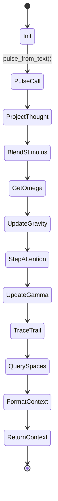

# Spatial Mind Audit

**File:** `core/spatial_mind.py`

---

### Overview
The `SpatialMind` class implements Helix’s dual 8‑dimensional cognitive manifold, managing two independent spaces (beliefs and memories) that share a projection matrix. It provides the core **spatial context** injected into the LLM prompt each pulse.

---

### Initialization (`__init__`) – lines 52‑78
```python
52-78: def __init__(self, embedding_dim: int = 384, base_dir: Path = None, sentinel=None):
    self.embedding_dim = embedding_dim
    self.base_dir = base_dir
    self.sentinel = sentinel
    self.belief_space = CognitiveSpace(...)
    self.memory_space = CognitiveSpace(...)
    self.memory_space.projection = self.belief_space.projection  # shared projection matrix
    self.attention_center = np.zeros(PROJECTION_DIM, dtype=np.float32)
    self.prev_center: Optional[np.ndarray] = None
    self._velocity = np.zeros(PROJECTION_DIM, dtype=np.float32)
    self._gamma = 0.5  # inertia coefficient
    self._identity_center = np.zeros(PROJECTION_DIM, dtype=np.float32)
    self._attention_velocity = 0.0
    self._last_pulse_time = 0.0
    self._belief_state_path = base_dir / "belief_space_state.json" if base_dir else None
    self._memory_state_path = base_dir / "memory_space_state.json" if base_dir else None
    self._attention_path = base_dir / "attention_center.npy" if base_dir else None
    self._embedder = None
    self._wake_flashes: list[str] = []
    self._load_attention()
```
**What:** Sets up two `CognitiveSpace` instances, forces them to share the same projection matrix so concepts map to identical 8‑D coordinates across belief and memory fields. Initializes attention dynamics (center, velocity, inertia γ) and persistence paths.
**Why:** Sharing the projection ensures consistent spatial reasoning; inertia γ enables deep‑focus dynamics; persistence allows state recovery across restarts.

---

### Lazy Embedder (`_get_embedder`) – lines 115‑130
```python
115-130: def _get_embedder(self):
    if self._embedder is None:
        from chromadb.utils.embedding_functions import DefaultEmbeddingFunction
        self._embedder = DefaultEmbeddingFunction()
        logger.info("Embedder loaded (ChromaDB default — all-MiniLM-L6-v2)")
    return self._embedder
```
**What:** Lazily loads the same MiniLM embedding model used by the legacy ChromaDB pipeline.
**Why:** Guarantees embedding compatibility between historic data and live pulses without eager import overhead.

---

### `embed_text` – lines 131‑147
```python
131-147: def embed_text(self, text: str) -> np.ndarray:
    embedder = self._get_embedder()
    if embedder is None:
        return np.zeros(self.embedding_dim, dtype=np.float32)
    result = embedder([text])
    return np.array(result[0], dtype=np.float32)
```
**What:** Returns a 384‑dimensional vector for a given string, falling back to zeros on failure.
**Why:** Needed for converting thoughts and stimuli into the shared 8‑D space for physics calculations.

---

### Pulse (`pulse`) – lines 150‑262
The heart of the spatial reasoning loop.

```python
150-262: def pulse(self, thought_embedding: np.ndarray, incoming_embedding: np.ndarray = None, agent_age_seconds: float = 3600.0) -> str:
    # 1. Project thought to 8D
    stimulus_pos = self.belief_space.projection.project(thought_embedding)
    # 2. Blend incoming stimulus if present
    if incoming_embedding is not None:
        incoming_pos = self.belief_space.projection.project(incoming_embedding)
        stimulus_pos = 0.5 * (stimulus_pos + incoming_pos)
        stimulus_strength = 1.5
    # 3. Get sentinel stability (Ω)
    omega = self.sentinel.omega if self.sentinel else 0.5
    # 4. Advance pulse counter and update gravity fields
    self._pulse_count = getattr(self, '_pulse_count', 0) + 1
    self.belief_space._current_pulse = self._pulse_count
    self.memory_space._current_pulse = self._pulse_count
    self.belief_space.update_gravity_field(agent_age_seconds)
    self.memory_space.update_gravity_field(agent_age_seconds)
    # 5. Compute affect force from Plutchik field (optional)
    affect_force = self._affect_steering * 0.5 if hasattr(self, '_affect_steering') else None
    # 6. Integrate attention via physics engine
    new_center, new_velocity = self.belief_space.step_attention(
        position=self.attention_center,
        velocity=self._velocity,
        stimulus_position=stimulus_pos,
        identity_center=self._identity_center,
        omega=omega,
        gamma=self._gamma,
        stimulus_strength=stimulus_strength,
        affect_force=affect_force,
    )
    # 7. Update inertia γ based on displacement
    displacement = np.linalg.norm(new_center - self.attention_center)
    if displacement < 0.5:
        self._gamma = min(self._gamma_max, self._gamma + self._gamma_growth)
    else:
        self._gamma = max(self._gamma_min, self._gamma - self._gamma_decay)
    # 8. Track velocity for Sentinel
    dt = time.time() - self._last_pulse_time if self._last_pulse_time > 0 else 1.0
    self._attention_velocity = float(np.linalg.norm(new_velocity))
    # 9. Determine query depths (k_beliefs, k_memories, n_trail)
    k_beliefs, k_memories, n_trail = self._get_query_depth()
    # 10. Trace cognitive trail (flashes) if prev_center exists
    flashes = []
    if self.prev_center is not None and n_trail > 0:
        belief_flashes = self.belief_space.trace_cognitive_trail(self.prev_center, new_center, n_waypoints=n_trail)
        memory_flashes = self.memory_space.trace_cognitive_trail(self.prev_center, new_center, n_waypoints=max(1, n_trail - 2))
        # deduplicate
        seen = set()
        for f in belief_flashes + memory_flashes:
            if f not in seen:
                seen.add(f)
                flashes.append(f)
    # 11. Query top‑k beliefs and memories
    nearby_beliefs = self.belief_space.gravity_ranked_query(new_center, k=k_beliefs)
    nearby_memories = self.memory_space.gravity_ranked_query(new_center, k=k_memories)
    # 12. Update state
    self.prev_center = self.attention_center.copy()
    self.attention_center = new_center
    self._velocity = new_velocity
    self._last_pulse_time = time.time()
    # 13. Format raw context string
    return self._format(flashes, nearby_beliefs, nearby_memories)
```
**What:**
1. Projects the conscious thought (and optional incoming stimulus) into 8‑D.
2. Retrieves the Sentinel’s stability metric (`Ω`).
3. Updates gravity fields for belief/memory points based on agent age.
4. Applies affect steering from the Plutchik emotional field if present.
5. Steps the attention center using Euler‑Lagrange integration (`step_attention`).
6. Adjusts inertia `γ` to encourage deep focus when the attention remains in a region.
7. Generates “flashes” that encode the cognitive trail for the LLM.
8. Performs gravity‑ranked queries to fetch the most context‑relevant beliefs and memories.
9. Returns a raw context string injected directly into the LLM prompt.

**Why:** This pipeline implements the theoretical model described in Helix’s design documents: a physical‑style attention particle moves through an 8‑D manifold, pulling in nearby high‑mass concepts (beliefs/memories) and leaving a trace (flashes) that the LLM can use as implicit memory.

---

### Prompt‑Injection Example
When the `pulse` method is called via `pulse_from_text`, the returned string is concatenated into the system prompt. Example (simplified):
```
⟪flash1⟫ ⟪flash2⟫
• Belief A [0.93]
• Belief B [0.78]
Recent memory snippet 1
Recent memory snippet 2
```
These raw tokens are **injected without labels** (see `_format` lines 321‑357) so the LLM treats them as part of the ongoing narrative.

---

### Bootstrap (`bootstrap`) – lines 359‑408
```python
359-408: def bootstrap(self, belief_graph=None, memory=None):
    if self.base_dir is None:
        logger.warning("SpatialMind.bootstrap called without a base_dir – cannot locate journal.")
        return 0, 0
    from memory.cognitive_journal import CognitiveJournal
    journal = CognitiveJournal(self.base_dir)
    entries = journal.load_all()
    for entry in entries:
        # parse entry_type, id, position, metadata
        if entry_type == "belief":
            self.belief_space.add_point(...)
        elif entry_type == "memory":
            self.memory_space.add_point(...)
    self._compute_identity_center(belief_graph)
    logger.info(f"SpatialMind bootstrapped from journal: {b_count} beliefs, {m_count} memories, x*={np.linalg.norm(self._identity_center):.3f}")
    return b_count, m_count
```
**What:** Loads the unified `cognitive_journal.jsonl` generated by `MemoryManager`, populates both spaces, and computes the identity center `x*`.
**Why:** Replaces the old ChromaDB bootstrap, guaranteeing that the spatial manifold reflects the current belief‑memory corpus at start‑up.

---

### Persistence (`save_state` / `load_state`) – lines 560‑601
These methods serialize the two `CognitiveSpace` objects and the attention vectors to disk, enabling graceful restarts.

---

### Mermaid Diagram – SpatialMind Pulse Cycle

The diagram visualizes the logical flow executed each pulse.

---

### Open Questions / Needs Clarification
- The `affect_force` scaling factor (0.5) is hard‑coded; is this intended to be tunable via configuration?
- `self._gamma_growth` / `self._gamma_decay` values are fixed; does the system expose a way to adapt them based on runtime stability metrics?
- Persistence paths use JSON for belief/memory state but NumPy `.npy` for the attention center. Should a unified format be considered for consistency?

---

*End of SpatialMind audit.*


*This file will contain line‑by‑line citations, explanations, and Mermaid diagrams for the `SpatialMind` subsystem.*
