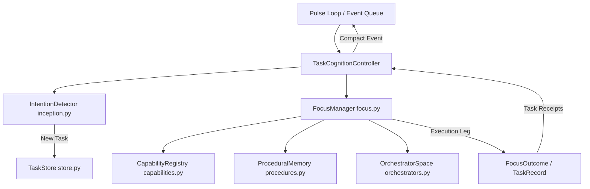

# Helix Cognitive Architecture: Task Cognition Subsystem Audit

**Target Directory:** `core/task_cognition/`  
**Key Modules:** `controller.py`, `focus.py`, `inception.py`, `models.py`, `procedures.py`, `capabilities.py`, `context.py`, `orchestrators.py`, `store.py`  
**Verified:** 2026-08-15  

---

## 1. Overview & Architecture

The **Task Cognition Subsystem** manages the complete lifecycle of task intentions, focus allocation, procedural memory, and active background execution. While main consciousness pulses proceed, Task Cognition detects concrete user intentions, assigns focus workers, selects appropriate capability subsets, and manages multi-step execution without clogging the primary context window.

---

## 2. Component Audits

### 2.1 `TaskCognitionController` (`core/task_cognition/controller.py`)
- **Modes:** Enforces three operating modes: `off`, `observe` (passive detection and monitoring), and `active` (full background execution and delegation).
- **Execution Invariant:** Active mode requires the standard `PulseLoop` and a tool-capable LLM provider (`gemini`, `anthropic`, `codex`, `codex_cli`). If conditions are not met, it safely falls back to `observe`.
- **Lifecycle Management:** Processes incoming turns, detects new intentions via `IntentionDetector`, advances pending tasks through `FocusManager`, and posts status events back to `PulseLoop`.

### 2.2 `IntentionDetector` (`core/task_cognition/inception.py`)
- **Responsibility:** Evaluates user messages to extract structured intentions and classify whether an action task or clarification task should be created.
- **Deduplication:** Prevents duplicate task creation by checking pending tasks in `TaskStore`.

### 2.3 `FocusManager` (`core/task_cognition/focus.py`)
- **Responsibility:** Manages focus worker sessions (`FocusOutcome`), task depth limits (`max_depth`), and adaptive capability routing.
- **Capability Selection:** Queries `CapabilityRegistry` to supply only the minimum required tool subset for a task leg.

### 2.4 `ProceduralMemory` (`core/task_cognition/procedures.py`)
- **Responsibility:** Records verified procedural routes and tracks route failures.
- **Feedback Loop:** Successful routes reinforce procedural confidence; failed routes surface as cautionary lessons for future task planning.

---

## 3. Storage & Data Protocol

- **Persistence Directory:** `data/tasks/`
- **Task Record (`TaskRecord`):** Contains task ID, goal, status (`PENDING`, `IN_PROGRESS`, `WAITING_INPUT`, `COMPLETED`, `FAILED`), current leg index, execution history, and typed receipts.

---

## 4. Verification

The Task Cognition subsystem is tested in:
- `tests/test_task_cognition.py`: Comprehensive test suite covering intention detection, task controller modes, capability selection, and procedural memory learning.
