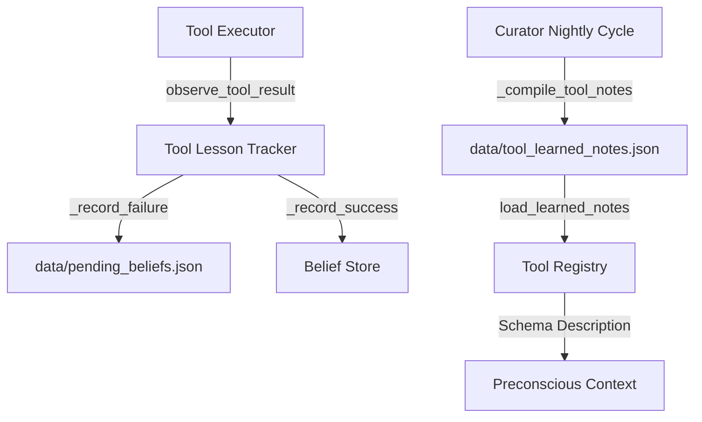

# Tool Learning Audit

> [!WARNING]
> **Historical code-audit snapshot.** Preserve its observations as recorded; line numbers and cross-subsystem claims may no longer match the live runtime. Use the [current architecture](../architecture_current.md) and [system manual](../../SYSTEM_MANUAL.md) for current behavior.

**Scope:** `core/tool_lesson_tracker.py`, `core/curator.py`, `tools/tool_registry.py`

## Runtime role

Dynamic tool learning operates as a closed loop consisting of real-time failure capture, nightly LLM-guided/deterministic distillation, and real-time validation feedback.

## 1. Real-time failure capture

- Every tool execution outcome is reported to `observe_tool_result()`. It must never throw exceptions or block tool completion. `core/tool_lesson_tracker.py:144-154`
- Failures matching the regex `_FAILURE_RE` are parsed into stable signatures by masking numbers and filesystem paths. `core/tool_lesson_tracker.py:49` (regex), `core/tool_lesson_tracker.py:96-102` (`_error_signature`)
- deduplicated failure candidates are written to `data/pending_beliefs.json` using the same lock `_pending_lock` and safety cap `MAX_PENDING` (200) as the `belief_detector`. `core/tool_lesson_tracker.py:114-140` (`_queue_candidate`), `core/tool_lesson_tracker.py:156-195` (`_record_failure`)

## 2. Nightly distillation and registry compilation

- During the nightly cycle, `Curator._compile_tool_notes()` scans all beliefs, groups those containing `tool_bindings`, and ranks them by `mass * confidence`. `core/curator.py:324-371`
- The top `TOOL_NOTES_MAX` beliefs for each tool are truncated to sentence boundaries, saved to `data/tool_learned_notes.json`, and injected into the live tool registry using `registry.apply_learned_notes()`. `core/curator.py:372-396`
- `apply_learned_notes()` backs up base schemas and appends `\nLearned: note1 | note2` directly to the JSON description fields, exposing them to the model in the next conscious turn. `tools/tool_registry.py:209-243`
- At boot time and during the morning wake phase, the registry reloads these descriptors via `load_learned_notes()`. `tools/tool_registry.py:244-259`

## 3. Real-time validation and feedback loop

- When a tool-bound belief is injected into the context, the preconscious layer registers it with the tracker via `note_lessons_injected()`. `core/tool_lesson_tracker.py:234-258`
- If that tool succeeds within `_VERIFICATION_TTL_SECONDS` (10 minutes), the tracker increments the belief's `verifications` count and stability index. Verified lessons survive nightly decay, while unverified ones decay out. `core/tool_lesson_tracker.py:196-231` (`_record_success`)

## 4. Deterministic workflow skills

- crystallized workflow patterns (e.g. from the `WorkflowDetector`) do not require LLM distillation. They are written directly to the belief store under the `skills` category using `record_workflow_skill()`. `core/tool_lesson_tracker.py:261-332`
- Directly written skills are registered with both the 8D manifold and 384D semantic index to keep coordinate systems synchronized. `core/tool_lesson_tracker.py:296-328`
