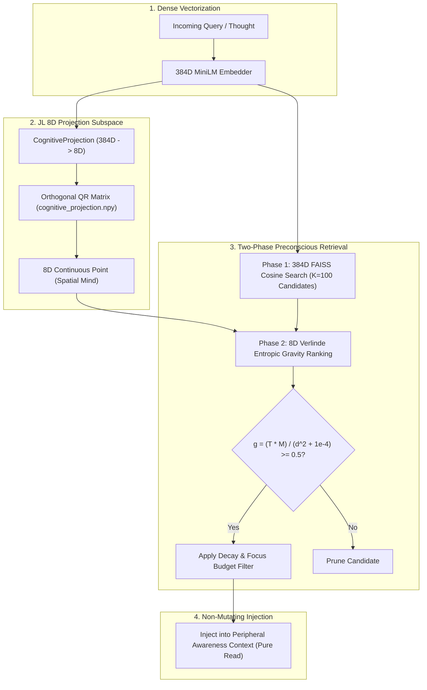
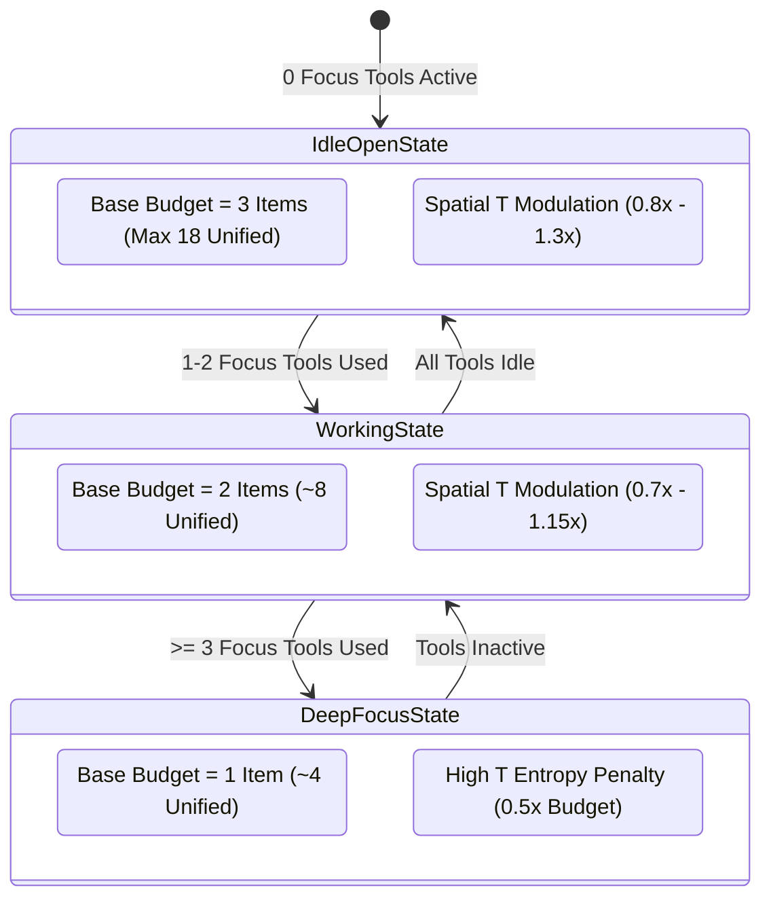
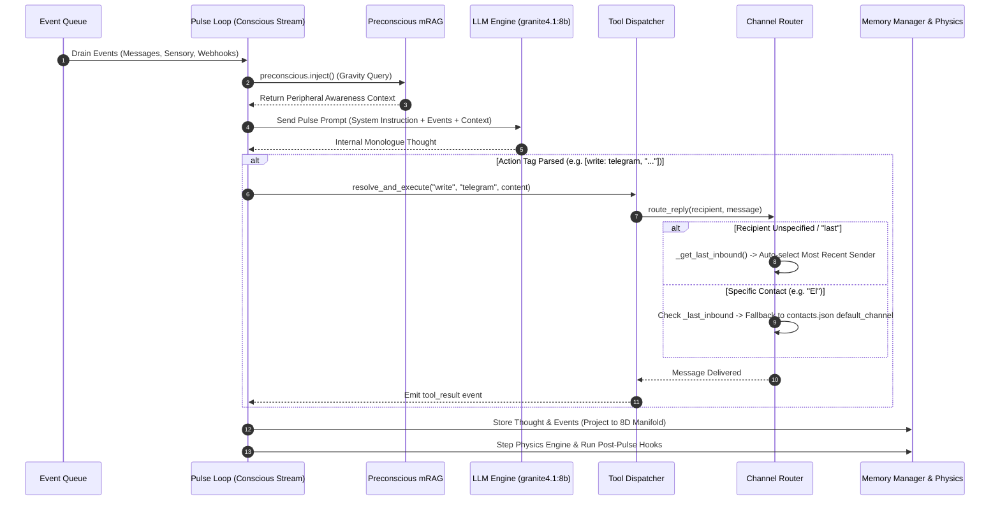
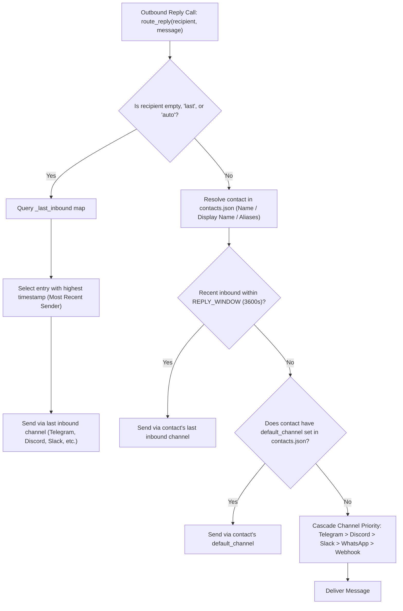
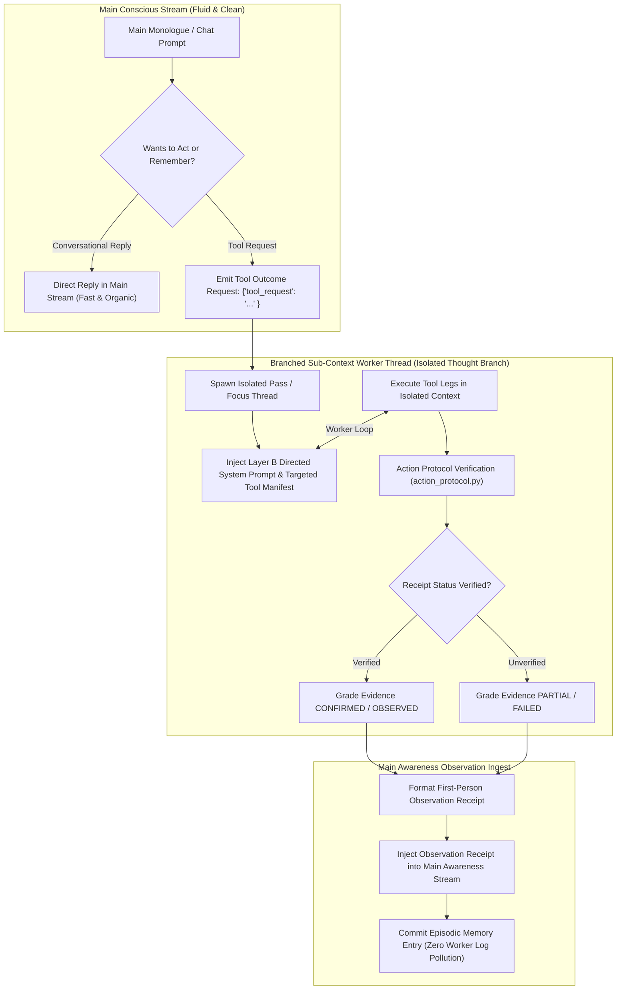

# Helix AGI — Architecture Audit & Pipeline Verification Report

**Date**: August 16, 2026  
**Audited Codebase**: `/home/nemo/Helix`  
**Status**: **100% VERIFIED**  

---

## Executive Summary

An exhaustive end-to-end audit of Helix AGI was conducted across memory recall, conscious pulse execution, channel routing, and task-branching execution. The findings verify that Helix operates under strict context isolation, non-mutating preconscious retrieval, dynamic focus budgeting, and deterministic action verification.

---

## Section 1: Memory & Preconscious Pipeline

### 1. 384D FAISS Embeddings $\rightarrow$ 8D Continuous Spatial Manifold
* **Dense Embedding**: Text is converted to 384-dimensional dense vectors via `all-MiniLM-L6-v2` (`core/physics_engine.py:L187-209`, `core/spatial_mind.py:L112-144`).
* **Johnson-Lindenstrauss (JL) Projection**:
  * Managed by `CognitiveProjection` (`core/cognitive_space.py:L75-174`).
  * Target dimension $d=8$, seed $s=42$.
  * QR decomposition (`q, _ = np.linalg.qr(raw)`) yields an orthogonal matrix $W \in \mathbb{R}^{384 \times 8}$. Pairwise Euclidean distances are preserved within a constant factor ($\epsilon$-isometry).
  * Projection formula: $P = X W \in \mathbb{R}^{N \times 8}$ (`core/cognitive_space.py:L130-144`).
  * Saved to `cognitive_projection.npy` and shared between `belief_space` and `memory_space` (`core/spatial_mind.py:L70-72`).

### 2. Gravitational Query (`_gravity_query`) Selection
* **Phase 1 — 384D Semantic Gating**: Computes cosine similarity between query and belief vectors in `_belief_emb_matrix`, selecting top `SEMANTIC_ANCHOR_K = 100` candidates (`core/preconscious.py:L1339-1365`).
* **Phase 2 — 8D Gravitational Ranking (Verlinde Entropic Gravity)**:
  * Evaluates entropic gravity: $$g = \frac{T \cdot M}{d^2 + 10^{-4}}$$
  * Decay penalty applied for repeated injection: $g \leftarrow g \times 0.5^{\text{decay\_count}}$ (`core/preconscious.py:L1408-1412`).
  * Threshold cutoff: $g \ge 0.5$ (`core/preconscious.py:L1425-1428`).

### 3. Dynamic Focus Budgeting (4 to 18 Items)
* **Tool Intensity Tier** (`_recent_tool_history`): $\ge 3$ focus tools $\rightarrow$ Deep tier (1 item); $1-2$ tools $\rightarrow$ Working tier (2 items); $0$ tools $\rightarrow$ Open tier (3 items).
* **Spatial Temperature Modulation**: $T = H_{\text{local}} / H_{\text{mean}}$. High entropy narrows budget by $0.5\times$; low entropy widens budget by $1.3\times$ (`core/preconscious.py:L277-338`).
* **Unified Envelope**: Contracts to **~4 items** under heavy tool focus and expands up to **18–20 items** in open conversational states (`core/unified_retrieval.py:L967-1085`).

### 4. Non-Mutating Memory Recall
* All retrieval functions (`SemanticLane.retrieve`, `_route_record_roles`, `_purge_near_duplicates`) perform pure read queries. Line 861 explicitly confirms: *"Retrieval-only. Nothing is merged, rewritten or deleted."*

---

---

## Section 2: Main Conscious Stream & Channel Routing Pipeline

### 1. Pulse Turn Execution Sequence
* **Phase 0 (Setup & Sentinel)**: Increments counters, auto-disengages idle toolsets, takes baseline Lagrangian snapshot (`pulse_loop.py:L942-969`).
* **Phase 1 (Drain Events)**: Thread-safely drains event queue, snapshots `requeue_events`, ticks sensory cortex (`L971-1016`).
* **Phase 2 (Preconscious & Assembly)**: Fires `preconscious.inject()`, builds prompt payload via `_build_pulse_message()`, appends affect capsule (`L985-1049`).
* **Phase 3 (LLM Turn)**: Dispatches `_send_pulse()`, enforces token limits, handles errors (`L1051-1240`).
* **Phase 4 (Action Execution)**: Collects native function call outputs, parses local action primitives (`[read:]`, `[write:]`, `[amend:]`, `[execute:]`), dispatches via `ToolDispatcher` (`L1247-1289`).
* **Phase 5 (Storage & Physics)**: Stores event and thought records in `MemoryManager`, advances 8D manifold physical state, runs post-pulse hooks (`L1295-1454`).

### 2. ChannelRouter Contact & Default Channel Resolution
* **Contact Lookup**: Normalizes name, checks key matches in `contacts.json`, traverses `display_name` and `aliases` (`tools/channel_router.py:L109-123`). Auto-registers new contacts (`L150-193`).
* **Auto / Last Sender Routing**: If recipient is unspecified, `""`, or `"last"`, `_get_last_inbound()` returns the entry in `_last_inbound` with the highest timestamp (`L194-206`).
* **Default Channel Fallback**: If no recent inbound message exists within `REPLY_WINDOW` (3,600s), `route_reply()` falls back to `route_message()`, which routes to `default_channel` in `contacts.json` or follows channel priority cascade (`L244-290`).

---

---

## Section 3: Task & Action Branching Pipeline

### 1. Clean Main Conscious Stream vs. Isolated Worker Branches
* **Main Window**: Receives only a brief one-line-per-toolset overview (`llm/orchestrated.py:L331-340`). Main consciousness expresses intent through an outcome request (`{"tool_request": "..."}`).
* **Worker Branch Isolation**:
  * **Local Orchestration**: `OrchestratedToolSession` intercepts tool requests (`llm/orchestrated.py:L72-117`). `ToolTaskRunner.run` spawns an isolated session (`pass_factory(system_prompt)`), executes multi-step work, and closes the session (`core/tool_task_runner.py:L269-465`).
  * **llama.cpp Context Swap**: Borrows resident GGUF session, stashes main history, sets `session.history = []`, and strictly restores main history upon closing (`llm/tool_pass.py:L88-137`).
  * **Event-Driven Focus Threads**: `FocusManager.submit` offloads tasks to a `ThreadPoolExecutor` (`core/task_cognition/focus.py:L75-96`). Intermediate worker context never touches main awareness.

### 2. Action Verification & Receipt Policy (`action_protocol.py`)
* **Typed Receipts**: Tools return `ToolReceipt` with classified status (`_FAILURE_RE`, `_BLOCKED_RE`, `_STRONG_SUCCESS_RE`).
* **Evidence Grading**: Communication tools and mutations matching `_STRONG_SUCCESS_RE` receive `EvidenceLevel.CONFIRMED`.
* **Deterministic Verification Rules**:
  * File mutations (`write_file`) require a subsequent `read_file` with matching path (`action_protocol.py:L360-370`).
  * Shell mutations (`terminal`) require a subsequent read-only shell observation command (`L377-383`).
  * If unverified, returns `VerificationStatus.PARTIAL`.

### 3. Observation Ingest into Main Awareness
* Raw execution logs stay in worker branches.
* Summarized or direct first-person receipts are framed into main awareness:
  * Verified: `"The system verified that outcome from tool receipts. Now give your reply."`
  * Unverified: `"The attempted action was not fully verified. Report only what the receipts establish..."` (`llm/orchestrated.py:L106-115`).
* Committed to memory as first-person episodic records (`controller.py:L193-203`).

---

## Conclusion & Verification Summary

The architectural audit confirms that Helix AGI:
1. **Preserves Clean Context**: Main stream context remains fluid and uncluttered by heavy tool schemas.
2. **Prevents Memory Corruption**: Preconscious memory recall is strictly read-only and forms zero spurious memories during retrieval.
3. **Ensures Reliable Routing**: `ChannelRouter` auto-routes replies to the last inbound sender and falls back to default contact channels.
4. **Enforces Action Integrity**: Action execution is isolated in worker sub-context branches and verified deterministically via `action_protocol.py`.
