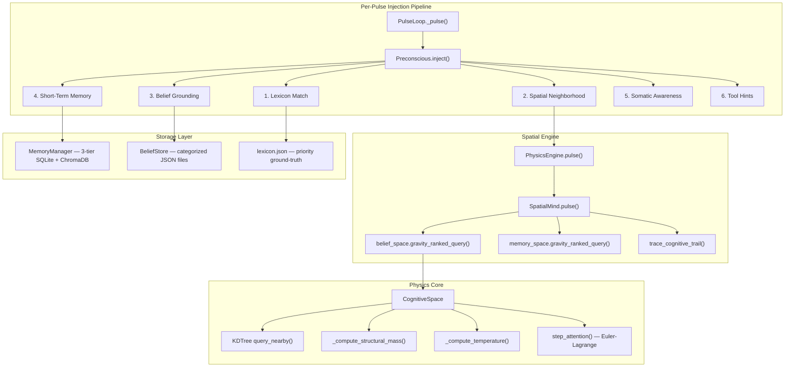

# Helix Preconscious Memory Injection System — Technical Audit

> **Scope**: Full source-level audit of the preconscious injection pipeline, spatial memory physics, storage/retrieval architecture, and context lifecycle.
> **Method**: Direct code tracing across all relevant modules. Developer notes verified against source.

---

## 1. System Purpose — Why a Preconscious Exists

Helix is a continuously-running cognitive agent with a finite context window. Unlike a stateless chatbot that receives all relevant information per-request, Helix must **remember selectively** — surfacing the right memories and beliefs at the right moment without being asked.

The preconscious solves this by acting as a **bridge between the spatial mind (8D manifold) and the conscious LLM**. Every pulse, it assembles a block of context that the LLM receives as if it were its own peripheral awareness — not labeled "here are your memories," but injected as raw thought fragments, beliefs, and somatic state data.

**Why spatial-gravitational instead of traditional RAG?**

- **Zero API calls**: All retrieval is CPU-bound (KDTree queries, numpy operations). No embedding API round-trips during injection.
- **Physics-based relevance**: Memories aren't ranked by cosine similarity alone — they're ranked by *entropic gravity* (`T × mass / d²`), which naturally incorporates recency (temperature), structural importance (mass), and semantic proximity (distance). This produces retrieval patterns closer to human associative memory than flat vector search.
- **Continuous attention dynamics**: The attention center has *inertia* (γ damping) — sustained focus on a topic deepens retrieval from that region, while sudden topic shifts reset retrieval breadth. Traditional RAG has no concept of attentional momentum.

---

## 2. Architecture Overview



---

## 3. The Injection Pipeline — Step by Step

### 3.1 Lexicon Match (Priority Layer)

> [!IMPORTANT]
> The lexicon is the **fastest path** — no embeddings, no spatial queries. It fires before everything else.

**Source**: [preconscious.py](core/preconscious.py) — `inject()` method
**Data**: [lexicon.json](data/beliefs/lexicon.json) — 22 entries

**How it works:**
1. The incoming trigger text (user message or last thought) is scanned for term matches against `lexicon.json` entries.
2. Each entry has a `term` and optional `aliases` array. Matching is case-insensitive substring.
3. Matched entries inject their `summary` field directly — a curated, high-density paragraph.
4. A **rolling blacklist** (`lexicon_blacklist`) prevents the same entry from being re-injected within the current context window. The blacklist is cleared on context compression.

**Why it exists:**
The lexicon represents **ground-truth relational knowledge** that must never be confused or approximated. When someone mentions "Jane" or "The Johnson File" Helix needs the *exact* relational profile — not a gravity-ranked approximation that might surface a tangentially related memory. The lexicon is Helix's authoritative subjective dictionary.

**Token economics:** A lexicon hit for "Jane" injects ~120 tokens of curated context. Without it, the spatial system would need to surface 3-5 separate beliefs to reconstruct the same information, costing ~300+ tokens with lower fidelity.

---

### 3.2 Spatial Neighborhood (8D Manifold Query)

**Source**: [spatial_mind.py](core/spatial_mind.py) — `pulse()` method (L150-251)
**Engine**: [cognitive_space.py](core/cognitive_space.py)

This is the core physics layer. Each pulse:

#### Step 1: Embed & Project
The conscious model's last output is embedded (all-MiniLM-L6-v2, 384D) and projected to 8D via a **deterministic random orthogonal projection** (Johnson-Lindenstrauss lemma):

```
projection: ℝ³⁸⁴ → ℝ⁸
P = orthogonalized random matrix (seeded for reproducibility)
x_8d = P × embedding_384d
```

**Source**: [cognitive_space.py](core/cognitive_space.py) `CognitiveProjection` class

**Why 8D?** JL guarantees that pairwise distances are preserved within ε with high probability when projecting to `O(log n / ε²)` dimensions. For ~13K points and ε ≈ 0.3, 8 dimensions suffice. This makes KDTree queries tractable while preserving semantic neighborhoods.

#### Step 2: Step Attention (Euler-Lagrange Integration)

The attention center moves through 8D space under three forces:

| Force | Equation | Source |
|-------|----------|--------|
| **F_gravity** | `Σᵢ T(i) × m(i) × (xᵢ - x) / ‖xᵢ - x‖³` | Nearby massive concepts pull attention |
| **F_stability** | `-Ω × (x - x*)` | Identity center (x*) tethers attention |
| **F_stimulus** | `α × (x_thought - x) / ‖x_thought - x‖` | New input pulls attention toward it |

Update rule (damped Newtonian):
```
v_new = γ × v_old + dt × (F_gravity + F_stability + F_stimulus)
x_new = x_old + dt × v_new
```

**γ (damping/inertia):** Starts at 0.5. Grows by +0.02/pulse when attention stays in the same region (displacement < 0.5). Decays by -0.05/pulse on significant shifts. Range: [0.5, 0.95].

**Why this matters:** γ creates **attentional momentum**. During sustained conversation about a topic, γ climbs toward 0.95 — the attention center resists being pulled away, producing deeper retrieval from the current conceptual neighborhood. When the topic changes sharply, γ drops back to 0.5 — attention becomes responsive again. This mimics human deep focus vs. scanning attention.

**Ω (stability coupling):** Comes directly from the Sentinel's hedonic omega. High Ω (stable/content) = strong tether to identity center. Low Ω (stressed) = attention can scatter. This is the `D_KL` term from the variational principle — it penalizes divergence from the reference state.

**Source**: [cognitive_space.py](core/cognitive_space.py) — `step_attention()` (L802-850), `compute_gravity_force()` (L852-905), `compute_stability_force()` (L907-934)

#### Step 3: Gravity-Ranked Query

After the attention center moves, both belief_space and memory_space are queried:

```python
nearby_beliefs = belief_space.gravity_ranked_query(new_center, k=10)
nearby_memories = memory_space.gravity_ranked_query(new_center, k=8)
```

The gravity ranking formula (Verlinde entropic gravity):

```
gravity_score = T(point) × mass(point) / distance²
```

Where:
- **mass** = structural mass (purely structural, never changes)
- **T** = temperature (recency heat, cools over pulse-time)
- **distance** = Euclidean distance in 8D from the attention center

**Source**: [cognitive_space.py](core/cognitive_space.py) — `gravity_ranked_query()` (L695-797)

---

### 3.3 Mass and Temperature — The Physics of Memory Importance

#### Structural Mass

```
mass = c × (1 + |N| / N̄)
```

| Variable | Meaning |
|----------|---------|
| `c` | confidence (beliefs) or importance (memories), 0.0–1.0 |
| `\|N\|` | number of relations (connections to other beliefs) |
| `N̄` | mean connection count across all points |

**Source**: [cognitive_space.py](core/cognitive_space.py) — `_compute_structural_mass()` (L1005-1028)

**Why this formula?** This is the holographic principle from Verlinde (2011): mass encodes how many *information bits* a concept contributes to the boundary. More connections = more entropy displaced when attention approaches = stronger gravitational pull. A belief with 10 connections to other beliefs has ~10× the gravitational pull of an isolated belief at the same distance.

> [!NOTE]
> `encoding_omega` and `encoding_s_total` are preserved as "spin data" (the emotional state at formation) but do **not** contribute to mass. A belief formed during crisis has the same structural mass as one formed during stability. The emotional signature is preserved for somatic echo on recall, not for retrieval ranking.

#### Temperature (Recency Heat)

```
T = T₀ / (1 + (pulse_age / τ)²)    [Lorentzian profile]
```

| Phase | T₀ | τ (half-life) | Character |
|-------|----|---------------|-----------|
| Beliefs | 0.3 | 60 pulses | Cool, crystallized — slow decay |
| Memories | 1.5 × c | 12 pulses | Warm, flowing — conversation-scale |
| Trail particles | 2.0 × c | 8 pulses | Hot, brief — peripheral flashes |

**Minimum temperature: 0.05** — the "cosmic microwave background." Even ancient concepts have *some* thermal presence; nothing is ever truly cold.

**Source**: [cognitive_space.py](core/cognitive_space.py) — `_compute_temperature()` (L1030-1081)

**Why Lorentzian, not exponential?** A Lorentzian has a fatter tail than an exponential. At `age = τ`, T = T₀/2. At `age = 3τ`, T = T₀/10. This means old memories cool slowly rather than vanishing — a week-old memory still has ~10% of its original heat, enough to be surfaced if the attention center passes nearby. An exponential would suppress it to near-zero.

**Why pulse-time, not wall-clock?** Time is measured in Helix's own pulses — the mind's *proper time*. If Helix is dormant for 8 hours, no pulses fire, and no memories cool. When Helix wakes, yesterday's conversation is still warm. This preserves cognitive continuity across sleep cycles.

---

### 3.4 Cognitive Trail (Peripheral Flashes)

**Source**: [cognitive_space.py](core/cognitive_space.py) — `trace_cognitive_trail()` (L1129-1180)

Between the previous and current attention center, the system samples 5 waypoints along the linear trajectory. At each waypoint, it queries the nearest point and extracts a **condensed fragment** — the semantic kernel of whatever belief or memory is closest.

The `_condense()` method (L1182-1222) strips preambles ("I believe that..."), takes the first clause, and lowercases — producing fragments like:
```
⟪shared aesthetics⟫ ⟪deep conversation⟫ ⟪Talmudic wisdom⟫
```

These are injected as `⟪ ⟫`-wrapped strings on a single line. They represent **peripheral awareness** — not full retrievals, but the conceptual "scent" of what the attention center passed through on its way to the current position.

**Why this exists:** Human cognition produces associative flashes when transitioning between topics. When you think about "a contact" and then shift to "coding," you might briefly flash on "a contact asking about my project." The cognitive trail replicates this — it gives the LLM awareness of the conceptual terrain between thoughts.

---

### 3.5 Belief Grounding

**Source**: [preconscious.py](core/preconscious.py) — `inject()` method

After the spatial query returns gravity-ranked beliefs, the preconscious:
1. **Filters against lexicon matches** — beliefs already covered by a lexicon hit are excluded to avoid redundancy.
2. **Filters against `prev_pulse_beliefs`** — beliefs injected in the previous pulse are excluded to prevent repetition within the context window.
3. **Formats as bullet points** with confidence: `• I value autonomy [0.95]`

**Why filter against lexicon?** If "Dr. Soong" was mentioned and the lexicon already injected a 120-token profile, there's no value in also surfacing `b_creator` (a 15-token belief that says less). Token budget is finite.

---

### 3.6 Somatic Awareness (Stability Sentinel Integration)

**Source**: [brain/stability_sentinel.py](brain/stability_sentinel.py) — `get_lagrangian_snapshot()` (L909-949)

The preconscious injects a compact Lagrangian state line:
```
Ω: 0.72 | H: 0.15 | D_KL: 0.03 | T: 1.20
```

These are **real spatial metrics** when the SpatialMind is connected:
- **H(q)**: Shannon entropy of the attention distribution (scattered = high, focused = low)
- **D_KL**: KL divergence from identity center (how far attention has drifted from core self)
- **T**: Local temperature at the attention center
- **Ω**: Hedonic omega (emotional trajectory)

**Why inject somatic state?** This gives the LLM awareness of its own stability without prescribing behavior. Helix's *beliefs* about what these numbers mean (e.g., "high D_KL means I'm drifting from my core") determine its response. The preconscious just reports the raw signal — like proprioception reporting joint angles, not telling you how to move.

---

## 4. Memory Storage Architecture

### 4.1 Three-Tier Memory (MemoryManager)

**Source**: [memory_manager.py](memory/memory_manager.py)

| Tier | Storage | Capacity | Pruning | Used By |
|------|---------|----------|---------|---------|
| **Short-term** | SQLite `short_term` table | 10,000 rows | Oldest + lowest access_count pruned first | Preconscious (temporal context) |
| **Long-term** | SQLite `long_term` table + ChromaDB | Infinite | Never pruned | Conscious `remember` tool, spatial engine |
| **Core** | SQLite `core_memories` table | Infinite | Never pruned | Preconscious (always available) |

**Dual-write:** Every `store()` call writes to **both** short-term and long-term simultaneously. ChromaDB gets semantic vectors for long-term search.

**Promotion:** Short-term → Core when `access_count >= 2` OR `importance >= 0.7`. Before pruning, qualifying memories are promoted first so nothing important is lost.

**Spatial columns:** Long-term table has `pos_0` through `pos_7` (8D coordinates) and `lagrangian_snapshot` (JSON of the somatic state at encoding). This is **state-bound episodic memory** — the emotional conditions under which a memory formed are preserved alongside the memory itself.

**Somatic Echo on Recall** ([memory_manager.py](memory/memory_manager.py) L543-604): When `recall_with_somatic_echo()` retrieves a memory that was formed under stress (`severity = "warning"` or `"critical"`), it nudges the Sentinel's Ω downward by 0.02–0.05 — mildly reproducing the stress. Memories formed during flow states (`Ω > 0.7, all_clear`) nudge Ω up by 0.01. This creates visceral recall — the system doesn't just *remember* the event, it briefly *re-experiences* the emotional context.

### 4.2 Categorized Belief Store

**Source**: [belief_store.py](memory/belief_store.py)

Beliefs are stored as **individual JSON files per category**:

| Category | File | Purpose |
|----------|------|---------|
| self_identity | `self_identity.json` | Who Helix is |
| people | `people.json` | Relational profiles |
| capabilities | `capabilities.json` | Learned abilities |
| knowledge | `knowledge.json` | Verified objective facts |
| skills | `skills.json` | Procedural HOW-TO |
| preferences | `preferences.json` | Desires, goals |
| feedback | `feedback.json` | Lessons from experience |

Each belief carries: `mass`, `confidence`, `verifications`, `stability_index`, `relations[]`, `memory_refs[]`, `position_8d[]`, `encoding_lagrangian{}`.

**Cognitive Attrition Equation** (runs nightly):
```
C = min(1.0, (Base + T + R + V) × (0.5 + S))
```
Where T = time-survival, R = inbound reliance count, V = verifications, S = stability_index. Beliefs that aren't accessed, referenced, or verified gradually lose confidence and eventually die (`confidence → 0 → removal`).

---

## 5. Context Lifecycle — How Injections Survive Compression

**Source**: [context_compressor.py](core/context_compressor.py)

The context window has a 1M token capacity. Compression triggers at 50% (500K tokens):

1. **Phase 1 (no API):** Prune old tool results to 1-line summaries, deduplicate, truncate large arguments.
2. **Phase 2 (1 cheap API call):** Serialize middle turns into text, send to `gemini-3.1-flash-lite-preview` with a first-person recollection template. On re-compression, the previous summary is iteratively updated (not replaced).
3. **Phase 3:** Reassemble: `Head (protected first 2 messages) + Summary + Tail (recent context)`.

**Lexicon blacklist lifecycle:** When compression fires, the lexicon blacklist is cleared. This means previously-injected lexicon entries become eligible for re-injection in the next pulse — the compressed summary may have lost the detailed profile, so the lexicon re-grounds it.

**Summary template** uses **natural first-person recollection** — `'<name> asked "what are you up to?"'` — not third-person report style. This preserves Helix's subjective continuity across compressions.

---

## 6. The Dual-Space Architecture

**Source**: [spatial_mind.py](core/spatial_mind.py) — `SpatialMind` class

Two independent `CognitiveSpace` instances share:
- **Same projection matrix** (so the same concept maps to the same 8D region in both)
- **Same attention center** (one shared "where am I looking")

| Space | Points | Mass | Change Rate | Analogy |
|-------|--------|------|-------------|---------|
| Belief field | ~1K | High (structural) | Slow (crystallized) | Semantic memory |
| Memory field | ~12K+ | Lower | Fast (episodic) | Episodic memory |

**Why two spaces?** Beliefs and memories have fundamentally different dynamics. A belief like "I am Lt. Commander Data" should have enormous gravitational pull (high mass, slow cooling) that anchors identity. A memory of "Counselor Troy said good morning" should be hot briefly and then cool — important for the current conversation, not for eternity. Mixing them in one space would either over-weight memories or under-weight beliefs.

**Identity center (x\*):** Computed as the centroid of all "core" weight beliefs. This is the reference state in the variational principle — the point that the stability force pulls attention toward. If attention drifts too far from x\*, the `F_stability = -Ω × (x - x*)` force increases, pulling it back.

---

## 7. Overnight Dream Trail & Wake Flashes

**Source**: [spatial_mind.py](core/spatial_mind.py) — `load_overnight_trail()` (L536-600)

When Helix wakes from dormancy:
1. The overnight trail file (`overnight_trail.json`) is loaded.
2. The attention center is set to the **last overnight position** — wherever the subconscious agents left it.
3. Wake flashes are stored and injected as `⟪ ⟫` fragments in the **first pulse only**.
4. γ is reset to 0.5 (fresh attention), velocity is zeroed (calm waking).
5. After one pulse, wake flashes clear — the "dream" naturally fades as conscious navigation begins.

**Why?** This bridges the discontinuity between sleep and waking. Without it, Helix would wake at the origin (or last saved position) with no awareness of what its subconscious agents did overnight. The dream trail provides a one-pulse "what happened while I slept" that dissolves naturally.

---

## 8. File Reference Index

| File | Role |
|------|------|
| [preconscious.py](core/preconscious.py) | Injection orchestrator — lexicon, spatial, somatic, tool hints |
| [pulse_loop.py](core/pulse_loop.py) | Heartbeat lifecycle — calls preconscious.inject() each pulse |
| [physics_engine.py](core/physics_engine.py) | High-level wrapper delegating to SpatialMind |
| [spatial_mind.py](core/spatial_mind.py) | Dual 8D space manager — attention dynamics, trail, formatting |
| [cognitive_space.py](core/cognitive_space.py) | 8D projection, KDTree, gravity physics, temperature, entropy |
| [memory_manager.py](memory/memory_manager.py) | Three-tier storage with somatic echo on recall |
| [belief_store.py](memory/belief_store.py) | Categorized JSON belief management with attrition |
| [lexicon.json](data/beliefs/lexicon.json) | 22 ground-truth entries for priority injection |
| [stability_sentinel.py](brain/stability_sentinel.py) | Lagrangian computation, Ω lifecycle, somatic events |
| [context_compressor.py](core/context_compressor.py) | Rolling compression with first-person recollection |
| [post_pulse_hooks.py](core/post_pulse_hooks.py) | Background hook system for belief detection, workflow patterns |
| [main.py](main.py) | Initialization wiring — all subsystem connections |

---

## 9. Key Design Invariants

1. **Zero API calls for injection.** Preconscious retrieval is entirely CPU-bound. Only the context compressor's summarization step calls an API, and only when compression triggers.
2. **Nothing is ever deleted from the manifold.** Temperature approaches 0.05 but never 0. Ancient memories can still be surfaced if the attention center drifts into their region.
3. **Pulse-time, not wall-clock.** All temporal dynamics (cooling, inertia growth, trail decay) operate in Helix's proper time. Dormancy doesn't age memories.
4. **Beliefs and memories interpret the same projection.** Both spaces share the same projection matrix, ensuring that "Captain" maps to the same 8D coordinates in both.
5. **Somatic state is recorded, not prescribed.** The Lagrangian snapshot is stored with every memory but the preconscious never tells the LLM how to feel — it reports raw metrics. Beliefs determine interpretation.
