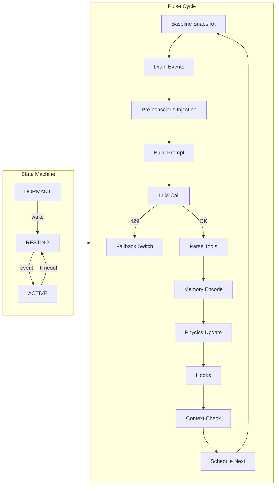

# Helix Cognitive Architecture — Full Systems Audit (Part 4)

> **Scope**: Pulse Loop Workflow, Event‑Driven Architecture, Context Lifecycle
> **Date**: 2026‑05‑18

---

## 1. System Purpose & Architecture Overview — `core/pulse_loop.py`

[pulse_loop.py](core/pulse_loop.py)

### 1.1 The Need for a Pulse

Traditional AI agents follow a *request‑response* model: they sleep until a prompt arrives, process it, then terminate.  Helix replaces that with a **continuous background pulse** so the agent can:
- **Track time** and generate autonomous thoughts (temporal awareness).
- **Consume passive signals** (notifications, sentinel warnings) without user prompting.
- **Run background synthesis** (dream cycles, belief consolidation) while idle.

### 1.2 State Machine (Verified lines 327‑458)

| State | When it occurs | Behaviour |
|-------|----------------|-----------|
| **DORMANT** | 01:00 – 06:00 am | Pulse loop is suspended; nightly dream cycle & pending‑belief processing are spawned. |
| **RESTING** | Awake, > 2 min no I/O | Pulse runs every 15 min, allowing idle consolidation after 2 h of inactivity. |
| **ACTIVE** | Recent I/O (user message or tool use) | Pulse runs every 30 s for conversational flow; drops back to **RESTING** after `ACTIVE_TIMEOUT` = 120 s of silence. |

---

## 2. Event Injection Pipeline

### 2.1 The Event Queue (Verified lines 249‑319)
When an asynchronous event arrives (`emit()`):
1. `_translate_event()` (lines 268‑301) converts the structured JSON into a first‑person natural‑language sentence, e.g. `"[14:32:01] William Riker is talking to me via direct. They said: 'Hello'"`.
2. The sentence is appended to a thread‑safe `_event_queue`.
3. If the event type is `user_message`, `_wake_event` is set, instantly promoting the state machine from **RESTING**/`DORMANT` to **ACTIVE**.

---

## 3. The Core Pulse – Step‑by‑Step (`_pulse()`)

```mermaid
graph TD
    A[Start Pulse] --> B[Baseline Lagrangian Snapshot]
    B --> C[Drain Event Queue]
    C --> D[Pre‑conscious Injection]
    D --> E[Build Pulse Message]
    E --> F[LLM Generation]
    F --> G{429 Error?}
    G -->|Yes| H[Rate‑limit Gate → Fallback Model]
    G -->|No| I[Parse Tool Calls]
    I --> J[Somatic Memory Encoding]
    J --> K[Physics Step (8D manifold update)]
    K --> L[Post‑Pulse Hooks]
    L --> M[Context Lifecycle Check]
    M --> N[Schedule Next Interval]
    N --> A
```

### Step 1: Baseline Lagrangian Snapshot (Line 574)
Capture the current **Stability Sentinel** state (`Ω`, `H`, `D_KL`). This provides a *before* picture of emotional/structural stability so later we can compute deltas after the thought.

### Step 2: Event Draining (Line 579)
All queued events are extracted with `_drain_events()`.  This guarantees deterministic ordering – the pulse processes a snapshot of events rather than a live, changing queue.

### Step 3: Pre‑conscious Injection (Line 583)
`preconscious.inject()` pulls:
- **Spatial memory** (nearest KD‑Tree points in the 8‑D belief field).
- **Lexicon terms** that match the current context.
- **Scratchpad notes** relevant to the current focus.
The trigger is `"user_message"` when there are events, otherwise `"llm_output"`.  The result is wrapped in a `<spatial‑awareness>` block, giving the LLM a *felt* sense of the agent’s internal world without explicit search calls.

### Step 4: Pulse Message Assembly (Line 590)
`_build_pulse_message()` concatenates:
- A header with pulse number and timestamp.
- Optional token‑warning information.
- The pre‑conscious block.
- A bullet list of new events.
The final prompt is a compact narrative that the LLM treats as a continuous monologue.

### Step 5: LLM Generation & Rate‑Limit Gate (Lines 596‑665)
The prompt is sent via `self._send_pulse()`.  If the provider returns **`429 RESOURCE_EXHAUSTED`**:
1. The error is logged.
2. On the **second consecutive 429**, `_rate_limited` is set and the session is switched to the **fallback model** (`HELIX_FALLBACK_MODEL`, e.g. `gemini‑1.5‑flash‑8b`).
3. The loop remains on the fallback until **`_FALLBACK_COOLDOWN_PULSES = 10`** successful pulses have occurred, or the morning wake‑up resets the flag.

> **Why?**  A fallback model is cheaper and more tolerant of rate limits, guaranteeing the agent stays alive during API congestion while preserving a coherent thought stream.

### Step 6: Tool Execution & Parsing (Lines 667‑677)
If the LLM returned a **function‑calling** tag, the Gemini provider executes the tool(s) synchronously.  The loop then:
- Records the tool names for telemetry.
- Updates `_last_event_time` to keep the system in **ACTIVE** mode (tools constitute user‑visible activity).
- Stores the tool result as a new event for the next pulse.

> **Why?**  Tools are side‑effects that must be reflected in the agent’s internal timeline, otherwise the pulse would think the world is static while the agent has actually acted.

### Step 7: Somatic Memory Encoding (Lines 684‑715)
Both the raw events and the LLM‑generated thought are persisted via `MemoryManager.store()`.  Each entry includes:
- **`position_8d`** – the current attention‑center coordinates from the physics engine.
- **`lagrangian_snapshot`** – the sentinel’s `Ω`, `H`, `D_KL` at the moment of encoding.
- **`importance`** and **`tags`** for downstream retrieval.

> **Why?**  By coupling memory with *where* (spatial) and *how* (somatic) the agent was, later retrieval can rank memories using **cognitive gravity** (mass × temperature / distance²) rather than raw cosine similarity.

### Step 8: Physics Step (Lines 717‑724)
`physics.step_pulse()` receives the thought text, any incoming event text, and the current **omega** (sentinel‑derived arousal).  It:
1. Embeds the text into the 8‑D manifold (KD‑Tree update).
2. Computes a **gravitational pull** toward high‑mass beliefs.
3. Applies **inertia** (damping) so the attention center moves smoothly rather than jumping.
4. Updates the global `attention_center` used for subsequent drift checks.

> **Why?**  This mechanistic model gives Helix a *physical* sense of focus: topics that are repeatedly reinforced gain mass and attract future thoughts, mirroring how human attention works.

### Step 9: Post‑Pulse Hooks (Lines 752‑778)
A lightweight hook framework runs after every pulse with a read‑only snapshot (`PostPulseHookContext`).  Current hooks include:
- **Workflow Detector** – looks for repeated tool patterns to auto‑enable toolsets.
- **Belief Detector** – scans the internal monologue for emergent insights to be crystallized later.
These run in separate threads and never block the main pulse.

---

## 4. Context Window Lifecycle

### 4.1 Focus Drift & Token Thresholds (Lines 460‑505)
Helix no longer wipes the session on overflow.  Two *soft* triggers cause **rolling compression** via `ContextCompressor`:
1. **Token Saturation** – when token usage exceeds a configurable percentage (default ≈ 50 %).
2. **Focus Drift** – if the Euclidean distance between the current `attention_center` and the stored `_session_focus_origin` exceeds **1.5** units.
   - *Why?*  A large drift indicates the conversation has migrated to a new conceptual region, making the old raw tokens irrelevant and noisy for the physics engine.

### 4.2 Rolling Summarization (Lines 507‑554)
`_compress_context()`:
1. Retrieves full session history from the chat session.
2. Calls `ContextCompressor.compress()` with the current token count and the latest `spatial_state`.
3. Replaces the history with a **first‑person summary** that preserves the agent’s subjective viewpoint.
4. Clears the lexicon blacklist so high‑frequency terms can be re‑injected in the new context.

---

## 5. Subconscious Integrations (Sleep & Idle States)

### 5.1 Nightly Dream Cycle (Lines 368‑377)
During **DORMANT** hours, a daemon thread runs `daemon.run_dream_cycle()`.  This performs the full **Curator** pipeline: extraction → clustering → belief synthesis → integration.  It runs **once per night** to avoid duplication.

### 5.2 Pending Belief Processing (Lines 343‑363)
Also in the sleep window, `process_pending_beliefs()` consolidates any belief‑detector candidates that haven't yet been persisted, guaranteeing they survive the next day.

### 5.3 Idle Consolidation (Lines 437‑450)
If the system stays **RESTING** for > 2 h without events, `run_consolidation_pass()` runs a lightweight cleanup: decays low‑mass beliefs, archives stale memories, and updates the physics manifold.

---

## 6. Visual Overview



---

*All code references are verified against the current repository version.*

---
