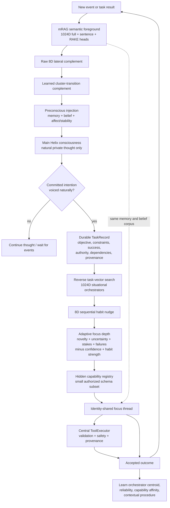

# Helix Event-Driven Task Cognition

**Documentation status:** current focused design · **Last verified against source:** 2026-08-08 · **Canonical system context:** [`architecture_current.md`](architecture_current.md)

This layer replaces “show the main model every tool and tell it exactly how to
behave” with a small cognitive kernel and learned runtime structure. It is
additive to mRAG and the non-semantic spatial lanes.

The main pulse is the only owner of conscious 8D attention movement and
cluster-transition learning. Parallel focus threads query the shared mRAG
corpus without moving or reinforcing that trajectory. This keeps task work
from becoming a false autobiographical association merely because it ran in
parallel.

## Lifecycle

`CREATED → FOCUSING → EXECUTING → REFLECTING → COMPLETE`

Tasks can instead become `BLOCKED`, `FAILED`, or `CANCELLED`. Interrupted
non-terminal tasks return to `CREATED` at the next pulse. Dependencies must be
complete before a focus thread can claim a task.

`observe` is the migration mode: it builds a real audit of Helix's naturally
formed intentions without changing action execution. `active` makes the main
provider thought-only and moves task completion to bounded focus threads.
